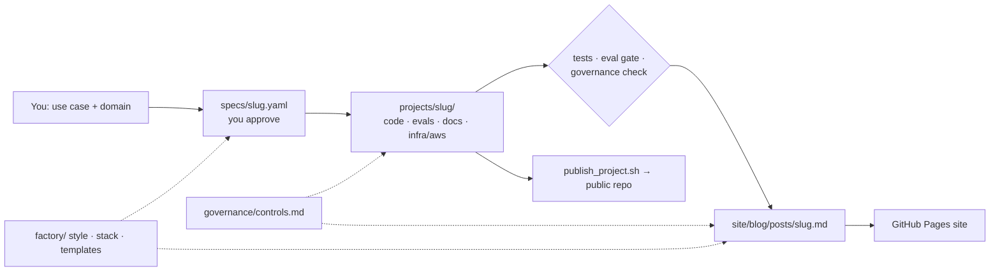

# ai-portfolio

Source for Ruairi Powers' AI-workflow portfolio: the website (blog + governance standard) and
the runnable project repos it links to — plus the templates and Claude skill that generate new
projects from a one-line use case.



## Layout

```
portfolio.yaml            author, site URL, GitHub owner, project order
governance/controls.md    the control catalog (source of truth; 30 controls)
factory/                  style guide, stack catalog, spec + blog templates
specs/                    one YAML per project (intent, requirements, governance focus)
projects/<slug>/          each project — becomes its own public repo on publish
site/                     MkDocs content (home, about, blog posts)
scripts/                  check_governance.py · publish_project.sh · mkdocs_hooks.py
.claude/skills/portfolio-project/   the generator Claude follows
.github/workflows/site.yml          build + deploy site to GitHub Pages
```

## One-time setup

1. Create a GitHub repo `ai-portfolio`, push this folder.
2. Nothing to edit: the site workflow fills in your GitHub username and Pages URL from the repo owner,
   so no personal settings are committed. For a custom domain, add a repository variable `SITE_URL`.
   Locally, `publish_project.sh` uses your `gh` login (or `PORTFOLIO_GITHUB_OWNER` / `PORTFOLIO_SITE_URL`).
3. Repo *Settings → Pages → Source: GitHub Actions*. The site deploys on every push to `main`.
4. Install the GitHub CLI and `gh auth login` (for publishing project repos).

## Everyday use

**New project** (in Claude Code in this repo, or any Claude session with the repo attached):

> Use the portfolio-project skill: *KYC document review for a fund administrator.*

Claude drafts `specs/<slug>.yaml` → you edit/approve → it builds, tests, writes the post, and
packages the repo. Publishing (`--push`) waits for your go-ahead.

**Your edits**: change anything — the governance catalog, the style guide, a spec, a post. Commit.
Claude reads the repo and your commits at the start of every run and treats your edits as authoritative.

**Local preview**

```bash
pip install -r requirements-site.txt
mkdocs serve                        # http://localhost:8000
python scripts/check_governance.py
```

## Live demos (Hugging Face Spaces)

Each project with a `Dockerfile.space` is synced to its own Docker Space by `.github/workflows/spaces.yml` on every
push to `main` (or run it by hand from the Actions tab). Demos use the offline mock models only; each visitor gets a
private copy of the data; every app reports to the governance console Space and obeys its kill switch.

One-time setup:

1. Create a Hugging Face account and a **write** token (*Settings → Access Tokens*).
2. In this GitHub repo, *Settings → Secrets and variables → Actions*:
   - secret `HF_TOKEN` — the Hugging Face token
   - secret `GOVERNANCE_INGEST_TOKEN` — any long random string (`python -c "import secrets; print(secrets.token_urlsafe(32))"`)
   - secret `GOVERNANCE_ADMIN_TOKEN` — another one; your sign-in for permanent kill-switch changes
   - optional secret `GOVERNANCE_DATABASE_URL` — a Postgres URL (e.g. Neon's free tier) so console history survives restarts
   - variable `HF_OWNER` — only if your Hugging Face username differs from your GitHub username
3. Run the **spaces** workflow (or push to `main`). Each Space builds in a few minutes.

**Always on or on demand.** Free CPU Spaces sleep after 48 hours without visitors and wake on the next visit (about
a minute). To keep them always on, set repository variable `HF_SPACE_HARDWARE=cpu-upgrade` (billed by Hugging Face per
hour per Space), or upgrade individual Spaces in their settings.

Build a Space folder locally without pushing: `python scripts/build_space.py <slug>` → `dist/spaces/<slug>/`.

## Governance console

`projects/governance-console` is the platform the other projects report to: usage, spend (daily and cumulative),
throughput, safety signals, control coverage with attestations, and a kill switch per workflow. New projects appear
in it automatically from `portfolio.yaml`, their spec and their `docs/governance.md`. Every workflow ships the same
`telemetry.py` (`python scripts/sync_telemetry_client.py` keeps the copies identical; CI checks it), and
`python scripts/build_catalog.py` refreshes the console's bundled catalog (also checked in CI).

## Project status

| Project | Status |
|---|---|
| altdata-triage | built — live demo via Spaces |
| eod-heartbeat | built — live demo via Spaces |
| trade-ops-exceptions | built — live demo via Spaces |
| research-qa-rag | built — live demo via Spaces |
| governance-console | built — governs the four above; live demo via Spaces |