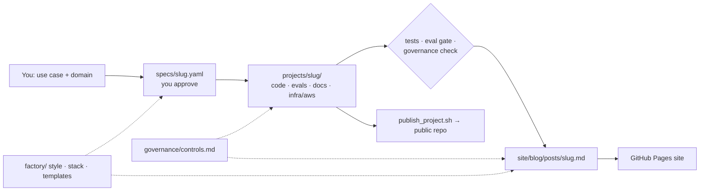

# ai-portfolio

Source for Ruairi Powers' AI-workflow portfolio: the website (blog + governance standard) and
the runnable project repos it links to — plus the templates and Claude skill that generate new
projects from a one-line use case.



## Layout

```
portfolio.yaml            author, site URL, GitHub owner, project order
governance/controls.md    the control catalog (source of truth; 30 controls)
factory/                  style guide, stack catalog, spec + blog templates
specs/                    one YAML per project (intent, requirements, governance focus)
projects/<slug>/          each project — becomes its own public repo on publish
site/                     MkDocs content (home, about, blog posts)
scripts/                  check_governance.py · publish_project.sh · mkdocs_hooks.py
.claude/skills/portfolio-project/   the generator Claude follows
.github/workflows/site.yml          build + deploy site to GitHub Pages
```

## One-time setup

1. Create a GitHub repo `ai-portfolio`, push this folder.
2. Nothing to edit: the site workflow fills in your GitHub username and Pages URL from the repo owner,
   so no personal settings are committed. For a custom domain, add a repository variable `SITE_URL`.
   Locally, `publish_project.sh` uses your `gh` login (or `PORTFOLIO_GITHUB_OWNER` / `PORTFOLIO_SITE_URL`).
3. Repo *Settings → Pages → Source: GitHub Actions*. The site deploys on every push to `main`.
4. Install the GitHub CLI and `gh auth login` (for publishing project repos).

## Everyday use

**New project** (in Claude Code in this repo, or any Claude session with the repo attached):

> Use the portfolio-project skill: *KYC document review for a fund administrator.*

Claude drafts `specs/<slug>.yaml` → you edit/approve → it builds, tests, writes the post, and
packages the repo. Publishing (`--push`) waits for your go-ahead.

**Your edits**: change anything — the governance catalog, the style guide, a spec, a post. Commit.
Claude reads the repo and your commits at the start of every run and treats your edits as authoritative.

**Local preview**

```bash
pip install -r requirements-site.txt
mkdocs serve                        # http://localhost:8000
python scripts/check_governance.py
```

## Live demos

One setting picks where the demos run: `demos.target` in `portfolio.yaml` (or repo variable `DEMOS_TARGET`).
`python scripts/demos.py list` shows the apps and their URLs for the current target; the **demos** workflow deploys
on every push to `main`. Links on the site, in READMEs and inside the apps follow the target.

| Target | Where | Cost | Setup | Status |
|---|---|---|---|---|
| `selfhost` (default) | your own machine, `https://demos.<domain>/<app>/` via a Cloudflare Tunnel | free | [deploy/selfhost](deploy/selfhost/README.md) | verified locally (all apps behind the proxy, path prefixes, WebSockets, telemetry) |
| `huggingface` | one Docker Space per app | Hugging Face PRO ($9/month) | secret `HF_TOKEN`, variable `HF_OWNER` | build + push verified up to Hugging Face's paywall |
| `cloudflare` | Cloudflare Containers behind a Worker on your domain | Workers Paid ($5/month) + usage | secrets `CLOUDFLARE_API_TOKEN`, `CLOUDFLARE_ACCOUNT_ID` | generated config checked; **not yet deployed** |
| `cloudrun` | Google Cloud Run, one service per app + a router at your domain | free tier (billing account required) | secret `GCP_SA_KEY`, variables `GCP_PROJECT`, `GCP_REGION` | deploy plan dry-run only; **not yet deployed** |

For every target except `huggingface`, set repo variable `DEMOS_URL` (e.g. `https://demos.example.com`). For all of
them, add repository secrets `GOVERNANCE_INGEST_TOKEN` and `GOVERNANCE_ADMIN_TOKEN` (long random strings) and
optionally `GOVERNANCE_DATABASE_URL`. Use **repository** secrets — secrets saved only in an Environment aren't passed
to the workflow. Every image is the same `Dockerfile.space`; it serves at a domain root or under `/<app>/`.

## Governance console

`projects/governance-console` is the platform the other projects report to: usage, spend (daily and cumulative),
throughput, safety signals, control coverage with attestations, and a kill switch per workflow. New projects appear
in it automatically from `portfolio.yaml`, their spec and their `docs/governance.md`. Every workflow ships the same
`telemetry.py` (`python scripts/sync_telemetry_client.py` keeps the copies identical; CI checks it), and
`python scripts/build_catalog.py` refreshes the console's bundled catalog (also checked in CI).

## Project status

| Project | Status |
|---|---|
| altdata-triage | built — live demo via Spaces |
| eod-heartbeat | built — live demo via Spaces |
| trade-ops-exceptions | built — live demo via Spaces |
| research-qa-rag | built — live demo via Spaces |
| governance-console | built — governs the four above; live demo via Spaces |
## License and credit

Copyright 2026 Ruairi Powers. Conceived, specified, directed and reviewed by Ruairi Powers, with Claude (Anthropic)
as AI coding assistant.

- **Code** (projects, scripts, workflows): [Apache License 2.0](LICENSE). Keep the copyright and the [NOTICE](NOTICE)
  file with any copy or derivative.
- **Writing** (`site/`, `governance/`, `factory/`): [CC BY 4.0](LICENSE-CONTENT). Credit the source and link the
  licence.

Credit it as: *Based on Ruairi Powers' AI Workflow Portfolio (https://github.com/ruairipowers-commits/ai-portfolio),
built with Claude.* GitHub's **Cite this repository** button reads [CITATION.cff](CITATION.cff).

**Restricting a project, or the repo.** `access:` in [portfolio.yaml](portfolio.yaml) sets each project to `open`,
`all-rights-reserved`, `private` (no code links on the site, kept out of the Ask assistant, never published as a
repo) or `hidden` (off the site and the demos too); `access.repo` does the same for the repo as a whole. Then run
`python scripts/apply_access.py` to rewrite the licence files; CI fails if they don't match. A level applies from
that commit on: earlier copies keep the licence they came with, and code in this public repo stays readable (move
it to a private repo to keep it secret).
