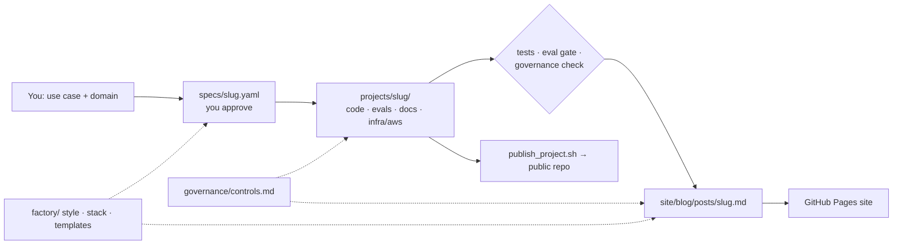

# ai-portfolio

Source for Ruairi Powers' AI-workflow portfolio: the website (blog + governance standard) and
the runnable project repos it links to — plus the templates and Claude skill that generate new
projects from a one-line use case.



## Layout

```
portfolio.yaml            author, site URL, GitHub owner, project order
governance/controls.md    the control catalog (source of truth; 30 controls)
factory/                  style guide, stack catalog, spec + blog templates
specs/                    one YAML per project (intent, requirements, governance focus)
projects/<slug>/          each project — becomes its own public repo on publish
site/                     MkDocs content (home, about, blog posts)
scripts/                  check_governance.py · publish_project.sh · mkdocs_hooks.py
.claude/skills/portfolio-project/   the generator Claude follows
.github/workflows/site.yml          build + deploy site to GitHub Pages
```

## One-time setup

1. Create a GitHub repo `ai-portfolio`, push this folder.
2. Nothing to edit: the site workflow fills in your GitHub username and Pages URL from the repo owner,
   so no personal settings are committed. For a custom domain, add a repository variable `SITE_URL`.
   Locally, `publish_project.sh` uses your `gh` login (or `PORTFOLIO_GITHUB_OWNER` / `PORTFOLIO_SITE_URL`).
3. Repo *Settings → Pages → Source: GitHub Actions*. The site deploys on every push to `main`.
4. Install the GitHub CLI and `gh auth login` (for publishing project repos).

## Everyday use

**New project** (in Claude Code in this repo, or any Claude session with the repo attached):

> Use the portfolio-project skill: *KYC document review for a fund administrator.*

Claude drafts `specs/<slug>.yaml` → you edit/approve → it builds, tests, writes the post, and
packages the repo. Publishing (`--push`) waits for your go-ahead.

**Your edits**: change anything — the governance catalog, the style guide, a spec, a post. Commit.
Claude reads the repo and your commits at the start of every run and treats your edits as authoritative.

**Local preview**

```bash
pip install -r requirements-site.txt
mkdocs serve                        # http://localhost:8000
python scripts/check_governance.py
```

## Project status

| Project | Status |
|---|---|
| altdata-triage | built — ready to publish |
| eod-heartbeat | planned — align existing Claude Code repo to the standard |
| trade-ops-exceptions | spec drafted |
| research-qa-rag | spec drafted |
