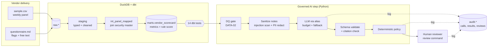
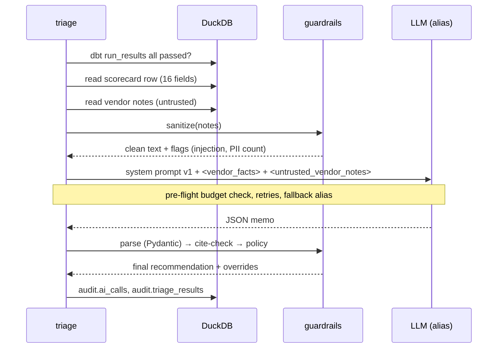

# Architecture — altdata-triage

## Flow

<!-- --8<-- [start:flow] -->

<!-- --8<-- [end:flow] -->

## Sequence for one vendor

## Why this shape

<!-- --8<-- [start:decisions] -->
| Decision | Chosen | Why | Alternatives considered |
|---|---|---|---|
| Numbers | dbt SQL, not the LLM | Metrics must be reproducible, testable and reviewable in a PR. LLMs are unreliable calculators. | Pandas notebooks; LLM code-interpreter |
| Orchestration | Fixed workflow | Triage steps are known in advance; a free-roaming agent adds cost and audit surface with no benefit. | LangGraph agent; Step Functions |
| Warehouse | DuckDB local | Zero-infra clone-and-run; identical dbt models run on Athena/Snowflake by switching target. | Postgres, Snowflake, Athena |
| LLM access | Thin provider adapter + registry | Provider-agnostic, auditable in ~200 lines; aliases make migrations a config change. | LiteLLM, LangChain model wrappers |
| Safety | Deterministic policy after the model | Compliance rules must hold even if the model is wrong or manipulated. | Relying on prompt instructions alone |
| Output | Pydantic schema + fallback | Downstream code never parses free text. | Provider JSON mode only |
<!-- --8<-- [end:decisions] -->
