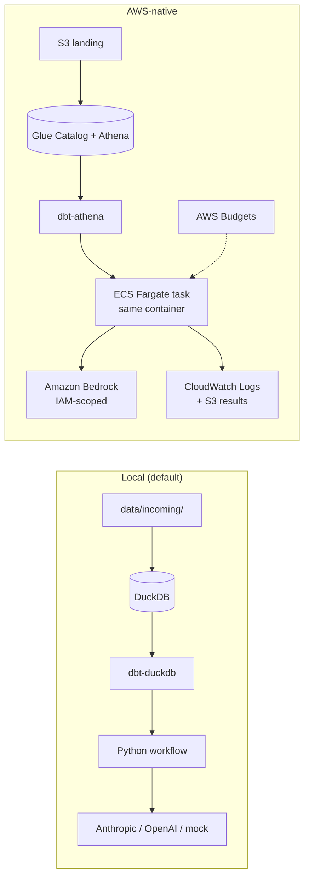

# Running altdata-triage AWS-native

The local build and the AWS build share the same Python package, dbt models, prompts,
evals and governance config. What changes is *where* each piece runs.



| Concern | Local | AWS-native | Change required |
|---|---|---|---|
| Landing | `data/incoming/` | S3 landing bucket | `aws s3 sync data/incoming s3://<landing>/` |
| Warehouse | DuckDB file | Glue Catalog + Athena | `pip install dbt-athena-community`; uncomment `athena` target in `dbt/profiles.yml`; declare the S3 files as external tables |
| LLM | `triage-primary: mock-local` | Bedrock | Set `bedrock-claude.model_id` (model or inference-profile ID from the Bedrock console), add pricing, `triage-candidate: bedrock-claude`, run the eval gate, then `promote` |
| Secrets | `.env` | IAM task role — no model key exists | none |
| Audit log | `audit.*` in DuckDB | CloudWatch Logs + S3 results bucket | write audit rows to S3/Athena (next increment) |
| Budgets | `cost.*` in config | same config **plus** AWS Budgets forecast alert | set `monthly_budget_usd`, `alert_email` |
| Least privilege | n/a | task role: read landing, write results, invoke only approved model ARNs | keep `approved_bedrock_model_arns` in sync with `models.yaml` |

## Steps

```bash
# 1. infrastructure (starter — review the plan before applying)
cd infra/aws
cp terraform.tfvars.example terraform.tfvars   # edit owner, email, model ARNs
terraform init && terraform plan

# 2. use Bedrock from your laptop first (standard AWS credentials / SSO profile)
pip install -e ".[aws]"
#   edit config/models.yaml: bedrock-claude.model_id, pricing; triage-candidate: bedrock-claude
altdata-triage eval --alias triage-candidate --baseline triage-primary
altdata-triage promote triage-primary bedrock-claude

# 3. container
docker build -t altdata-triage .
# push to the ECR repo from `terraform output ecr_repository_url`, run as an ECS task
```

## Status and honest gaps

- **Works today:** Bedrock provider (Converse API) in `llm.py`; Terraform for storage, Athena, ECR, logs, IAM, budget.
- **Not yet built:** Athena-backed ingestion (`ingest` still reads local files) and writing `audit.*` to S3. These are the next increments.
- **Not validated against a live account yet** — run `terraform validate` and `plan` first.
- AWS Budgets tag filtering requires activating the `project` cost-allocation tag in Billing.

## Other cloud options (not implemented)

| Layer | Azure | GCP | Snowflake-centric |
|---|---|---|---|
| Landing | ADLS Gen2 | GCS | Stage on S3/Azure/GCS |
| Warehouse + dbt | Fabric / Synapse (`dbt-fabric`) | BigQuery (`dbt-bigquery`) | Snowflake (`dbt-snowflake`) |
| LLM | Azure OpenAI / Azure AI Foundry | Vertex AI (incl. Claude) | Snowflake Cortex |
| Secrets | Key Vault | Secret Manager | Snowflake secrets |
