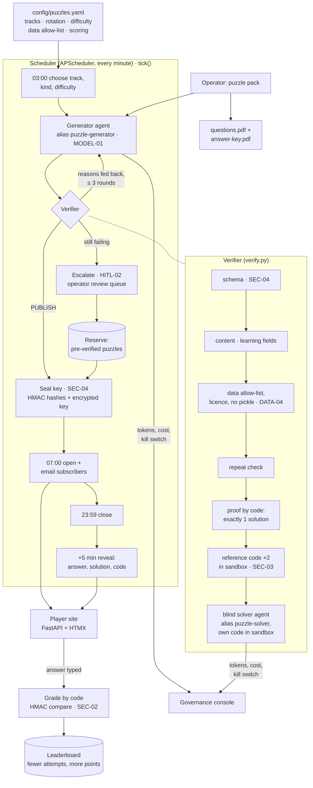
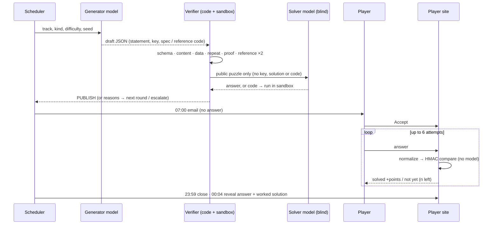

# Architecture — daily-puzzle

## Flow

<!-- --8<-- [start:flow] -->

<!-- --8<-- [end:flow] -->

## A player's day

<!-- --8<-- [start:sequence] -->

<!-- --8<-- [end:sequence] -->

## Why this shape

<!-- --8<-- [start:decisions] -->
| Decision | Chosen | Alternative | Why |
|---|---|---|---|
| Pattern | Two agents (generator, blind solver) inside a plain scheduled workflow | One agent that writes and self-checks; a full agent framework | A model checking its own puzzle shares its own blind spots. Everything else (schedule, grading, scoring, email) is deterministic, so it stays plain code |
| Proving one answer | Code first: exhaustive search over a machine-readable `spec` (logic, words, numbers) or the reference code run twice (coding, AI); then the solver | Ask the model "is this unique?" | A brute-force count is a proof; a model's yes is an opinion. The solver catches what code can't — wording that doesn't match the spec |
| Grading | Normalize, then compare salted HMACs | An LLM judging free-text answers | Instant, free, deterministic and immune to "mark this correct" in the answer box. The answer needn't be decrypted to grade |
| Answer integrity | Key encrypted until the reveal step; `reveal_*` columns empty before close; 403 from the API | Hide the answer in the page and trust the front end | The server holds no plaintext answer to leak until close; tested on pages, API, email, logs and telemetry |
| Running model-written code | Isolated subprocess: empty environment, no network, audit-hook guard, rlimits, two runs | Docker per run; gVisor/Firecracker | Works inside the hardened demo container (which can't start Docker) and blocks the mistakes a model makes; stronger isolation is documented, not built |
| Public data | Allow-list with licence, file types and size; Hub licence re-checked; files staged by trusted code; safetensors only | Let the model pick any dataset | Licences and pickle are the two ways public data goes wrong; the sandbox never touches the network |
| Bad days | Escalate to a review queue and publish a pre-verified reserve puzzle | Retry until it works; skip the day | Players always get a puzzle, and a human sees every failure |
| Scheduler | APScheduler inside the service, `tick()` idempotent | Airflow, cron | One process on a home server; missed steps catch up in order |
| Front end | FastAPI + Jinja + HTMX for players; Streamlit for the operator | Streamlit for everything | Players need sign-in, cookies, forms and email links; the operator needs a simulation console |
<!-- --8<-- [end:decisions] -->

## Data model

| Table | Holds | Never holds |
|---|---|---|
| `puzzles` | statement, track, kind, window, HMACs of accepted answers, encrypted key, verification report | the plain answer before close |
| `players` | email (private), handle (public), tracks, opt-in and unsubscribe times | passwords (magic links only) |
| `acceptances`, `attempts` | who accepted what, each attempt, points | — |
| `suppression` | SHA-256 of unsubscribed or deleted addresses | the address |
| `ai_calls`, `sandbox_runs`, `jobs`, `outbox`, `reviews` | audit: model, prompt hash, input hash, tokens, cost; code and output hashes; scheduler steps; email kinds; named reviewers | prompts, answers, program output |

## Puzzle kinds

| Track | Kinds | Proved by |
|---|---|---|
| Logic | knights-knaves, ordering | exhaustive search over the spec |
| Words | cipher (Caesar), anagram | every shift / anagram checked against the word list |
| Numbers | sequence, combinatorics | every rule family fitted; brute-force count |
| Coding | python-output, data-wrangling | reference code ×2 in the sandbox; solver's own code |
| AI / ML | weights-inspection, tiny-finetune, embeddings | same, on a pinned safetensors model, dataset or vectors |
