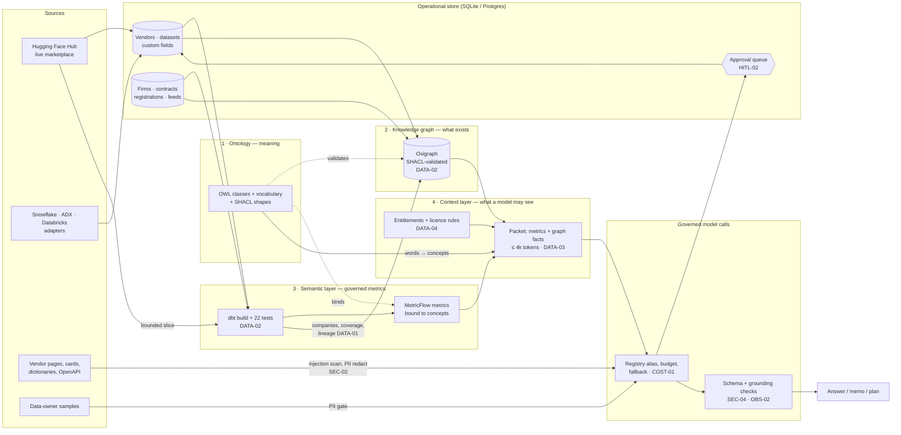
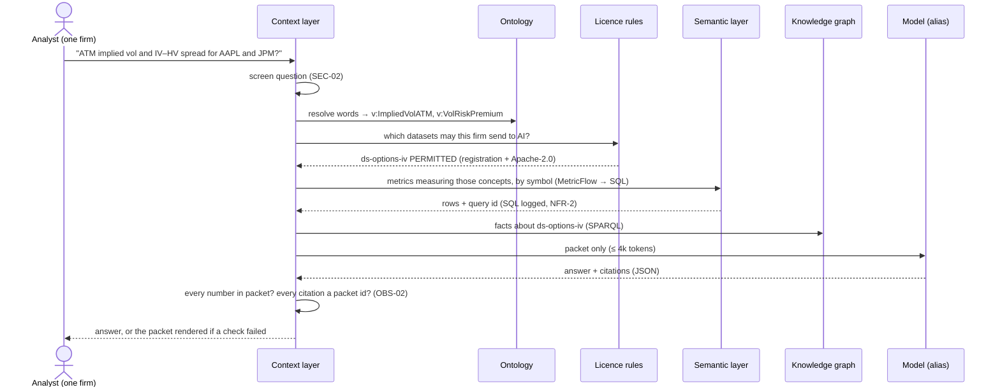

# Architecture — data-lifecycle-platform

## Flow

<!-- --8<-- [start:flow] -->

<!-- --8<-- [end:flow] -->

## Answering one question

<!-- --8<-- [start:sequence] -->

<!-- --8<-- [end:sequence] -->

## What lives where

| Layer | Holds | Never holds | Read with |
|---|---|---|---|
| Ontology (`ontology/`) | classes, properties, the vocabulary (concepts, categories, licences, sectors, factors), SHACL shapes | vendors, datasets, companies, numbers | rdflib; `ontology.resolve()` |
| Knowledge graph (`warehouse/graph`) | instances: vendors, datasets, fields → concepts, companies → sectors, contracts, entitlements, lineage, metric pointers, factor sensitivities | metric values, raw data, free text beyond names | SPARQL (`graph.py`) |
| Semantic layer (`semantic/`) | dbt models + tests, MetricFlow semantic models and metrics, each bound to a concept IRI | meaning, entitlements | `semantic.query()` (MetricFlow → DuckDB, read-only) |
| Context layer (`context.py`) | nothing persistent: builds one packet per question, logs its hash | anything the firm isn't entitled to send to an AI model | `context.build()` |

## Decisions

<!-- --8<-- [start:decisions] -->
| Decision | Chosen | Why | Alternatives |
|---|---|---|---|
| Separate meaning from instances | OWL/Turtle ontology + SKOS vocabulary, Oxigraph graph built from the catalog | The vocabulary changes slowly and is reviewed; instances change daily and are generated. Mixing them makes both hard to govern. | One property graph (Neo4j) with labels as "schema" |
| Graph quality gate | SHACL, refuse to load on violation | The same idea as dbt tests, for relationships. It caught real gaps while building (lineage nodes with no type). | Python checks; OWL reasoning |
| Metrics | dbt semantic models + MetricFlow, metric → concept IRI | One definition used by the app, API, MCP and the model; the SQL behind every number is logged | Hand-written SQL views; Cube; LookML |
| What the model sees | A per-question packet built by code | Entitlements, licence and token budget are enforced before the model, not hoped for in a prompt | RAG over catalog text; tool-calling agent |
| Who decides usage rights | Code (licence rules + contracts), legal for unclear cases | A model reading a vendor's own claims is exactly the wrong judge | Model-classified licences |
| Extraction | Code for structured sources, model for pages/PDFs, quote per value, human approval | Structured schemas don't need a model; free text does, but must be checkable | Fully automatic catalog writes |
| Pattern | Workflows plus one read-only "agent surface" (MCP) | Each workflow is a known sequence; open-ended tool use adds risk without benefit here | LangGraph agent with write tools |
| Orchestration | Dagster assets over the same functions the CLI calls | Asset lineage matches the dbt graph; CI and the demo don't need a scheduler running | Airflow (used in eod-heartbeat) |
| Marketplaces | One adapter interface; Hugging Face live, three on recorded responses | Honest about what was run; adding a live adapter is credentials + one method | Separate integration per venue |
<!-- --8<-- [end:decisions] -->
