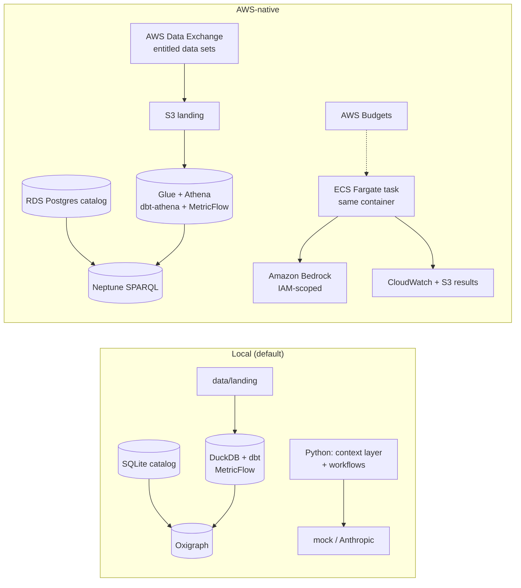

# Running data-lifecycle-platform AWS-native

Same package, prompts, evals, ontology and dbt project; different places to run them. The four layers map one to one.

| Concern | Local | AWS-native | Change required |
|---|---|---|---|
| Landing | `data/landing` | S3 landing bucket | `aws s3 sync data/landing s3://<landing>/`; point dbt sources' `external_location` at S3 |
| Semantic layer | DuckDB + dbt-duckdb + MetricFlow | Glue Catalog + Athena (dbt-athena), MetricFlow in the task | add an `athena` target to `semantic/profiles.yml`; `semantic.query()` executes the MetricFlow SQL through the Athena client instead of DuckDB (one function) |
| Knowledge graph | Oxigraph on disk | Neptune (SPARQL 1.1) | `graph.build()` bulk-loads N-Triples via Neptune's loader from S3; `graph.sparql()` posts to the Neptune endpoint with SigV4. SHACL validation stays in the task before load |
| Operational store | SQLite | RDS Postgres | `DLP_DATABASE_URL` from Secrets Manager |
| Orchestration | `dlp build` / Dagster | EventBridge → ECS task, or Dagster on ECS / MWAA | none to the code |
| Marketplace | Hugging Face live; ADX on fixtures | AWS Data Exchange live | set `AWS_DATA_EXCHANGE_ROLE_ARN`; the adapter calls `list_data_sets(Origin="ENTITLED")` |
| LLM | `dlp-primary: mock-local` | Bedrock | set `bedrock-claude.model_id` and pricing, point `dlp-candidate` at it, run the eval gate, `promote` |
| Entitlements | `licensing.py` | same, plus Lake Formation tag-based access on the Athena tables as a second line (not built) | — |
| Secrets | `.env` | IAM task role, Secrets Manager for Postgres | none |
| Run log | `AICall` table | Postgres + CloudWatch Logs (~7 years) + S3 | `governance.log_retention_days` |
| Budgets | `cost.*` + `cost-report` | AWS Budgets forecast alert at 80% | `monthly_budget_usd` in tfvars |

The Terraform in [`infra/aws`](../infra/aws) is a starter: S3, Glue/Athena, Neptune Serverless, RDS, ECR, the task role
(scoped to approved Bedrock model ARNs, the two buckets, the Athena workgroup and the Neptune cluster) and a budget.
It has been written and reviewed but **not applied** to a live account.
