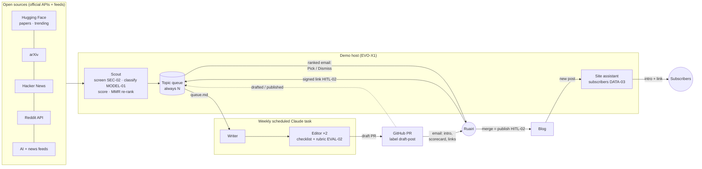
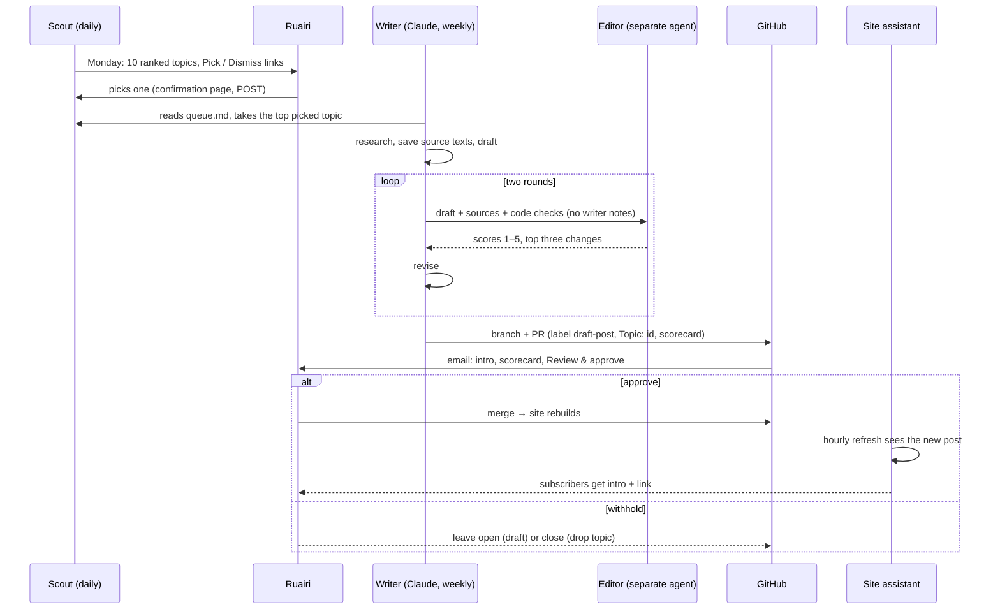

# Architecture — editorial-agents

<!-- --8<-- [start:flow] -->

<!-- --8<-- [end:flow] -->

## Weekly sequence

<!-- --8<-- [start:decisions] -->
| Decision | Chosen | Why | Alternative |
|---|---|---|---|
| Who writes and edits | Scheduled Claude task, writer + a separate editor subagent | Best writing on the owner's plan; no API key on the server; the editor never sees the writer's reasoning | Local model (weaker), Claude API on the host (key on the server) |
| How a post is approved | Merge the PR | The host keeps no write access to the repo; GitHub keeps the draft, the review and the history | One-click approve link (would need a repo-write token on the host) |
| Topic sources | Official APIs and RSS only | Within each site's terms; predictable; testable with fixtures | Scraping (fragile, against terms), LinkedIn (no API) |
| Novelty | TF-IDF against published posts + MMR | Deterministic, no extra model, explainable numbers | Embeddings (better paraphrase detection) |
| Engagement | Source signals as percentiles within each source + model interest + recency | Comparable across sources without pretending 300 HN points = 300 Reddit upvotes | Learn weights from the site's own likes once there's history |
| Owner's email links | Signed, expiring, single-use, confirm-then-POST | Mail scanners follow links; a GET must change nothing | Login page (more friction for one click) |
| Subscriptions | In the site assistant, double opt-in | It already sees every published post and sends email | A newsletter service (another account, another processor of addresses) |
<!-- --8<-- [end:decisions] -->
