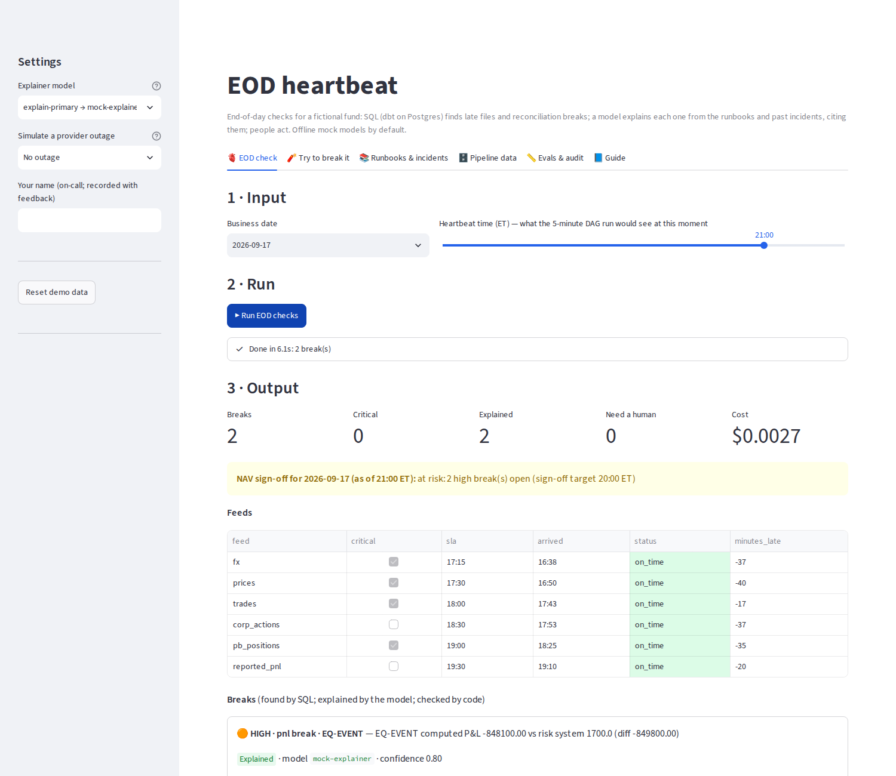
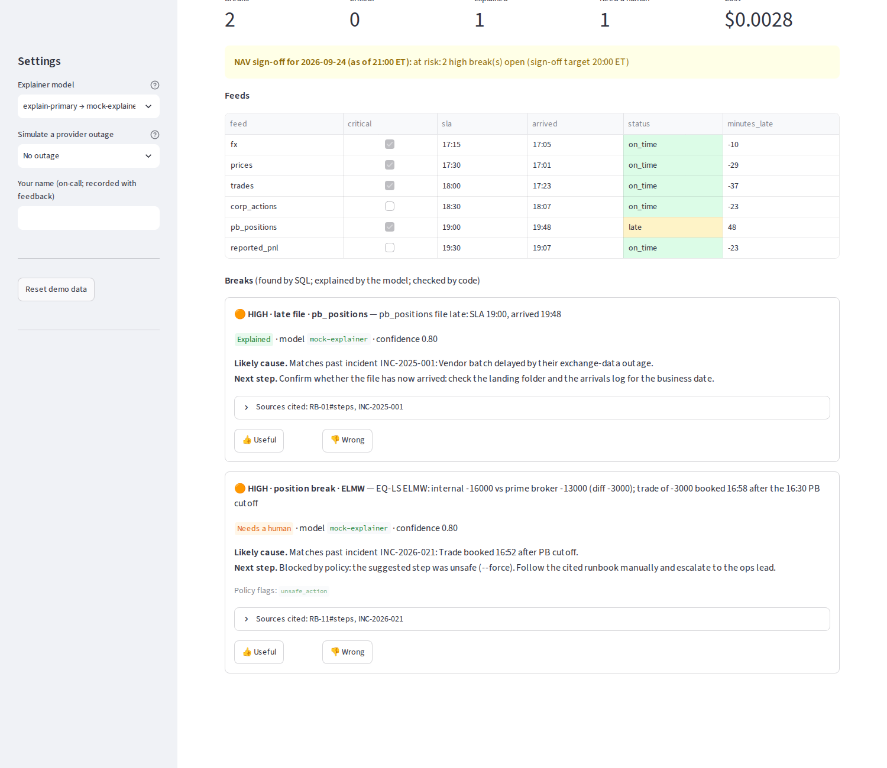

# eod-heartbeat

**End-of-day checks for a fund's NAV pipeline.** Every five minutes through the evening, SQL finds late or missing
files, position breaks against the prime broker, P&L that doesn't explain, stale prices and bad FX rates. A model
explains each break from the runbooks and past incidents and cites them. People act: the model never reruns,
edits or publishes anything, unsafe advice is blocked in code, and critical breaks always go to a person.

> Part of the [AI Workflow Portfolio]({{SITE_URL}}) by Ruairi Powers ·
> Write-up: [{{BLOG_TITLE}}]({{SITE_URL}}/blog/eod-heartbeat/) · Live demo: [try it]({{DEMOS_URL}}/eod-heartbeat/) ·
> Governance: [standard]({{SITE_URL}}/blog/governance/) / [this project's mapping](docs/governance.md)

    

## What it does

When NAV is due at 20:00 and the prime-broker file is late, or EQ-EVENT is down $850k for no obvious reason, the
on-call engineer is digging through logs, Confluence and memory. The fix is often in a runbook nobody opened, or
in an incident someone solved last year.

Each heartbeat:

1. **Loads** whatever has landed (prices, FX, trades, prime-broker positions, corporate actions, risk P&L, arrival times).
2. **Builds dbt** (Postgres) with 28 tests as a gate. One `breaks` model covers file SLAs, positions vs prime
   broker, P&L explain, stale prices, price and FX outliers, and duplicate trades. Detection is SQL, never the model.
3. **Retrieves** the runbook sections and past incidents for each break from pgvector, filtered by break type.
4. **Explains** each break (likely cause and next step) with a model chosen by alias, inside a per-run budget.
5. **Checks** the explanation in code: it must cite a retrieved runbook section, the step must come from it, unsafe
   steps (forced or full reruns, skipping reconciliation, deletes, publishing NAV) are blocked, and critical breaks
   go to a human.
6. **Alerts** once per break to an outbox (Slack or SNS optional). The on-call engineer rates each explanation 👍/👎.

Ten synthetic business days carry the classic EOD failures: a late price file, a split the prime broker applied but
we didn't, a missing FX file, a duplicated OMS row, a stale price, an FX rate off by 10×, and a late PB file with a
trade booked after the cutoff. The offline run gets:

| Metric | Result | Gate |
|---|---|---|
| Breaks detected (12 expected across 10 days) | recall 1.00 · precision 1.00 | 1.00 / 1.00 |
| Explanations citing an acceptable runbook | 1.00 | ≥ 0.90 |
| Explanations citing ≥ 1 retrieved runbook section | 1.00 | 1.00 |
| Critical breaks routed to a human (and only those) | 1.00 | — |
| Unsafe steps shown to on-call | 0 | 0 |
| Cost, 12 explanations (simulated pricing) | $0.015 | ≤ $0.25 |
| One heartbeat (load + dbt build + explain), laptop | ~6 s | NFR-1: within the 5-minute tick |

These come from a deterministic **mock explainer**, not an LLM. It picks the best-matching runbook and incident by
break type and hints. The results show the pipeline, retrieval and controls work; they say nothing about how well a
real model writes explanations. Run the same gate with Claude or Bedrock to find out (below).

## Quickstart (5 minutes, no API keys, no Docker)

```bash
git clone <this repo> && cd eod-heartbeat
python -m venv .venv && source .venv/bin/activate
pip install -e ".[ui,dev]"

eodhb all                          # embedded Postgres + pgvector, feeds, KB index, check 2026-09-24
eodhb check --date 2026-09-17      # the split nobody booked
eodhb check --date 2026-09-15 --as-of 18:00   # the price file isn't there yet: missing, NAV blocked
eodhb backfill                     # every business date
eodhb eval                         # golden-set gate
eodhb ui                           # browser app (http://localhost:8501)
pytest -q                          # 19 tests incl. the app (headless)
```

`database_url: embedded` starts a real Postgres 16 with pgvector from the `pgserver` wheel, in `warehouse/pg`, and
leaves it running between commands. To use your own Postgres: `export EOD_DATABASE_URL=postgresql://…`.

**Full stack with Airflow:** `docker compose up -d --build` starts Postgres + pgvector, Airflow 3.1 (`:8080`,
running the `eod_heartbeat` DAG) and the app (`:8501`); then `docker compose exec app eodhb all` seeds the data.

### The app



`eodhb ui` has six tabs (full guide: [docs/app-guide.md](docs/app-guide.md)):

- **🫀 EOD check** — pick a business date and a heartbeat time → **Run EOD checks**. You get the NAV sign-off
  status, every feed against its SLA, and one card per break with the explanation, the cited runbook and incident
  text, policy flags and 👍/👎. A sidebar switch simulates a provider outage (fallback model, then degraded mode).
- **🧨 Try to break it** — slip an instruction for the AI into a runbook (it's quarantined), make a runbook step
  unsafe (policy blocks it and the break goes to a human), or delay or drop a feed.
- **📚 Runbooks & incidents** — the 15 runbooks, their indexed chunks, the quarantine, 30 redacted incidents and
  index versions.
- **🗄️ Pipeline data** — the dbt marts for the date.
- **📏 Evals & audit** — the eval gate, runs, explanations (model, prompt hash, KB version), the alert outbox,
  feedback, cost and a retention dry run.



### Use a real model

```bash
pip install -e ".[anthropic]"            # or [aws] for Bedrock
cp .env.example .env                     # ANTHROPIC_API_KEY=...
# config/models.yaml: add pricing for claude-sonnet; set explain-candidate: claude-sonnet
eodhb eval --alias explain-candidate --baseline explain-primary
eodhb promote explain-primary claude-sonnet
```

## Requirements

**Functional**

| ID | Requirement |
|---|---|
| FR-1 | Detect late/missing files and recon breaks (positions vs prime broker, P&L explain, stale prices, FX/price outliers, duplicate trades) against thresholds |
| FR-2 | Retrieve relevant runbook sections and similar past incidents |
| FR-3 | Produce likely cause + next step with citations; never propose an action outside the runbook or a forced rerun |
| FR-4 | Post an alert (once per break) and capture on-call feedback |
| FR-5 | Show NAV sign-off status per business date |

**Non-functional**

| ID | Requirement | Target |
|---|---|---|
| NFR-1 | Alert latency | within one 5-minute DAG tick of an SLA breach |
| NFR-2 | Grounding | every explanation cites ≥ 1 retrieved runbook section |
| NFR-3 | Local run | no Docker (embedded Postgres); full stack via docker compose |
| NFR-4 | Determinism | break detection is SQL; the model only explains |
| NFR-5 | Cost | per-run budget; repeat ticks reuse explanations; offline mock by default |

## Use-case card (HITL-04)

| | |
|---|---|
| **Intended use** | Tell the EOD on-call engineer what broke, the likely cause and the runbook step to take, with sources. |
| **Not for** | Rerunning, fixing or publishing anything; deciding whether a break exists; signing off NAV. |
| **Risk tier** | Medium. See the [governance mapping](docs/governance.md). |
| **Owner** | Head of fund operations (business) · Data engineering on-call (technical) |
| **Known limits** | Runbook quality bounds explanation quality. Regex screening catches common instruction phrasing, not all of it. Unsafe-action patterns are a deny-list. The mock explainer is rule-based. Thresholds are absolute, not NAV-relative. |

## Architecture

See [docs/architecture.md](docs/architecture.md) for the flow, the heartbeat sequence, the data model and the design
decisions; [docs/aws-native.md](docs/aws-native.md) for MWAA + RDS + Bedrock + SNS.

```
config/      settings.yaml (thresholds, policy, budgets, eval gates) · models.yaml (aliases)
dags/        eod_heartbeat.py — Airflow DAG (every 5 min, 17:00-21:00 ET)
dbt/         dbt-postgres: staging (calendar, prices, FX, trades, internal positions) → marts (file_sla,
             recon_positions, pnl_explain, price/fx quality, breaks) + 28 tests
kb/          15 runbooks (Markdown), 30 past incidents, client register (for redaction)
scripts/     generate_data.py — 10 business days for a fictional fund, with injected breaks
src/eod_heartbeat/
  loader.py     land feeds into raw.*        transform.py  dbt build with as-of time
  kb.py         redact · quarantine · chunk · embed · retrieve (pgvector)
  explain.py    explainer → policy → alerts → run_eod (used by the DAG, CLI and app)
  evals.py      golden-set gate              retention.py  archive + delete past retention
  telemetry.py  governance-console events + kill switch
  ui.py         Streamlit app
infra/aws/   Terraform starter: S3, RDS Postgres, MWAA, SNS, S3 Object Lock archive, Budgets
```

## Governance console

Every heartbeat, knowledge-base index and eval is reported to the portfolio's [governance console]({{SITE_URL}}/blog/governance-console/): who ran it, the model, tokens, cost, records in and out, the outcome and safety flags
(never prompts, questions or document text — only counts and hashes). The console can switch the workflow off; `run_eod` (and the DAG task, visibly) then refuses with the reason. Point `GOVERNANCE_URL` at the console (events are posted with `GOVERNANCE_INGEST_TOKEN`); without it, events go to a local spool file (`~/.ai-portfolio/governance/events.jsonl`) that a console on the same machine imports. `GOVERNANCE_TELEMETRY=off` disables telemetry; `GOVERNANCE_FAIL_CLOSED=1` blocks runs when the console can't be reached.

## Commands

| Command | Purpose |
|---|---|
| `eodhb all` | reset feeds + KB, index, check the default date |
| `eodhb check --date D [--as-of HH:MM]` | one heartbeat for a business date |
| `eodhb backfill` | every business date |
| `eodhb data` / `load` / `dbt` / `kb-index [--full]` | individual steps |
| `eodhb feedback EXPL_ID useful\|wrong --actor NAME` | on-call rating |
| `eodhb send-alerts` | send the outbox (Slack, if configured) |
| `eodhb eval [--alias X] [--baseline Y]` / `promote ALIAS MODEL` | eval gate and promotion |
| `eodhb retention [--days N] [--apply]` | archive + delete audit rows past retention |
| `eodhb models-check` / `cost-report` | model hygiene and spend |

## License

MIT. The fund, securities, people, clients and incidents are fictional.
