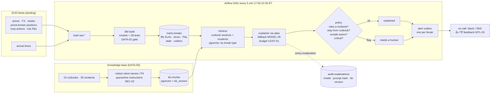
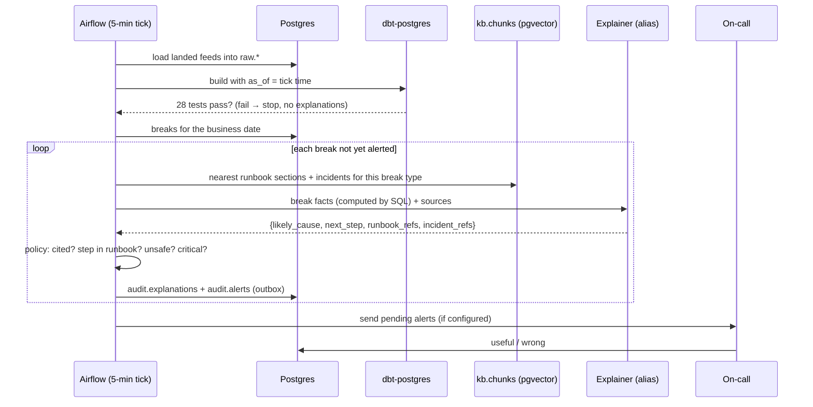
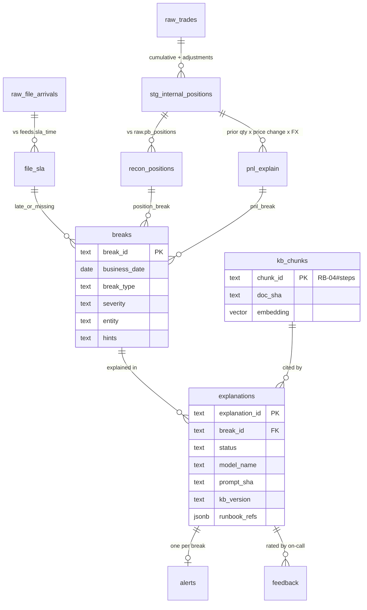

# Architecture — eod-heartbeat

## Flow

<!-- --8<-- [start:flow] -->

<!-- --8<-- [end:flow] -->

## Sequence: one heartbeat

## Why this shape

<!-- --8<-- [start:decisions] -->
| Decision | Chosen | Why | Alternatives considered |
|---|---|---|---|
| Detection | Deterministic SQL in dbt (one `breaks` model) | Whether a break exists must be reproducible, testable and reviewable in a PR. The model never decides that. | Anomaly-detection model; LLM reading raw files |
| Pattern | RAG explainer per break, single call | The knowledge is in runbooks and incident history. One grounded call per break is cheap and auditable. | Agent that runs diagnostic queries (more power, much more risk on a NAV night) |
| Orchestration | Airflow DAG, 5-minute ticks 17:00–21:00 ET | The most common orchestrator in fund data teams; frequent idempotent ticks meet "alert within 5 minutes" without sensors. Alerts are de-duplicated per break. | Dagster, Prefect, Step Functions, cron |
| Store | Postgres for data, marts, audit **and** vectors (pgvector) | One system to run, back up and secure; the KB is small. | Separate vector DB (OpenSearch, Qdrant) |
| Local Postgres | Embedded via pgserver (Postgres 16 + pgvector) | Clone-and-run with no Docker; same SQL as RDS. docker compose for the full stack with Airflow. | Docker only; SQLite (no pgvector, different SQL) |
| Retrieval filter | Break type → runbook `break_types`, then the causes + steps sections of the top two runbooks are always included | Retrieval can't drift to an unrelated runbook, and the step the model cites is the real step. | Pure vector search |
| Guardrails | Policy after the model: must cite a retrieved runbook, the step must come from it, unsafe-action patterns are blocked, critical breaks always go to a human | A runbook can be wrong or tampered with; advice on NAV night must be checkable. | Prompt rules alone |
| Resilience | Fallback model, then degraded mode (alert with runbook steps, no explanation) | The alert matters more than the prose. A provider outage must not hide a break. | Fail the run |
<!-- --8<-- [end:decisions] -->

## Data model

