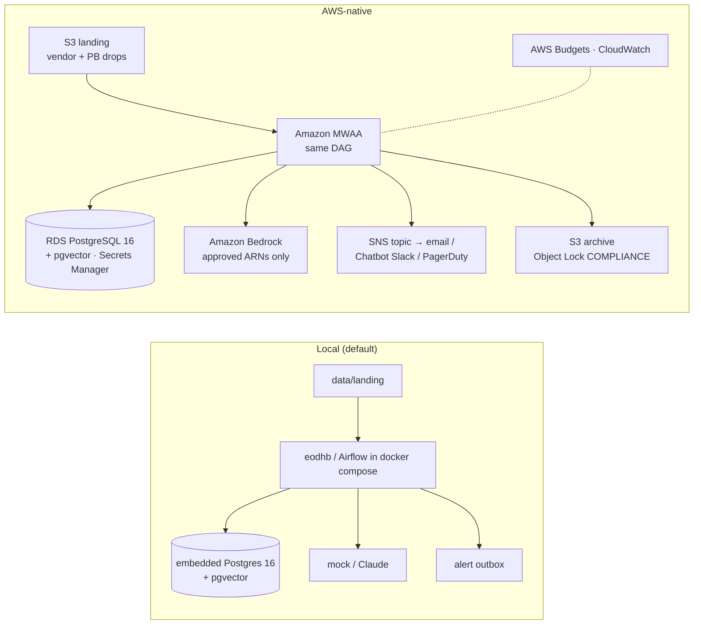

# Running eod-heartbeat AWS-native

The DAG, the dbt project, the knowledge base and the explainer code are the same; what changes is where they run.



| Concern | Local | AWS-native | Change required |
|---|---|---|---|
| Landing | `data/landing/<date>/` | S3 landing bucket | Read from S3 in `loader.load` (the CSV parsing is unchanged) |
| Database + vectors | embedded Postgres (pgserver) | RDS PostgreSQL 16 with `vector` | `EOD_DATABASE_URL` from the RDS-managed secret; `eodhb` creates the extension on first connect |
| Orchestration | `eodhb check` / Airflow 3 in docker compose | MWAA, same `dags/eod_heartbeat.py` | Upload `dags/` and a `requirements.txt` with this package + `dbt-postgres` to the MWAA bucket |
| Explainer | `explain-primary: mock-explainer` | Bedrock | Set `bedrock-claude.model_id` + pricing, `explain-candidate: bedrock-claude`, eval gate, `promote` |
| Alerts | `audit.alerts` outbox (+ optional Slack webhook) | SNS topic with subscriptions | Add an `sns` branch to `send_pending` (`boto3.client("sns").publish`) |
| Retention archive | `output/archive/` JSONL + manifest | S3 bucket with Object Lock in COMPLIANCE mode for the retention period | Point `governance.archive_dir` at the bucket (write with boto3) |
| Spend | `cost-report`, governance console | AWS Budgets on the project tag | `terraform apply` |

## Steps

```bash
cd infra/aws && cp terraform.tfvars.example terraform.tfvars   # VPC, two private subnets, on-call email, model ARNs
terraform init && terraform plan                              # review: MWAA and RDS take ~30 minutes to create
aws s3 cp ../../dags/eod_heartbeat.py s3://$(terraform output -raw mwaa_bucket)/dags/
# requirements.txt: eod-heartbeat @ git+https://github.com/<you>/eod-heartbeat  and  dbt-postgres
```

## Status and honest gaps

- **Works today:** the DAG imports and runs end to end on Airflow 3.1 (`airflow dags test` against the embedded
  Postgres — every task succeeds), and the whole pipeline runs on Postgres 16 + pgvector.
- **Not exercised:** MWAA itself, RDS, SNS and Bedrock calls; `terraform validate` hasn't been run (the build
  environment can't download Terraform). MWAA's newest Airflow version may lag Airflow 3; the DAG imports
  `airflow.sdk` on 3.x and falls back to `airflow.decorators` on 2.x, but that path hasn't been run.
- **Not built:** the S3 reader in the loader, the SNS sender, writing the archive to S3.
- dbt runs as a subprocess inside the worker. At larger scale, use Cosmos (astronomer-cosmos) to render dbt models
  as Airflow tasks, or dbt Cloud.

## Other cloud options (not implemented)

| Layer | Azure | GCP |
|---|---|---|
| Airflow | Azure Data Factory Workflow Orchestration Manager (managed Airflow) | Cloud Composer |
| Postgres + vectors | Azure Database for PostgreSQL (pgvector) | Cloud SQL / AlloyDB (pgvector) |
| Models | Azure OpenAI | Vertex AI |
| Alerts | Azure Monitor action groups | Pub/Sub → Cloud Functions |
