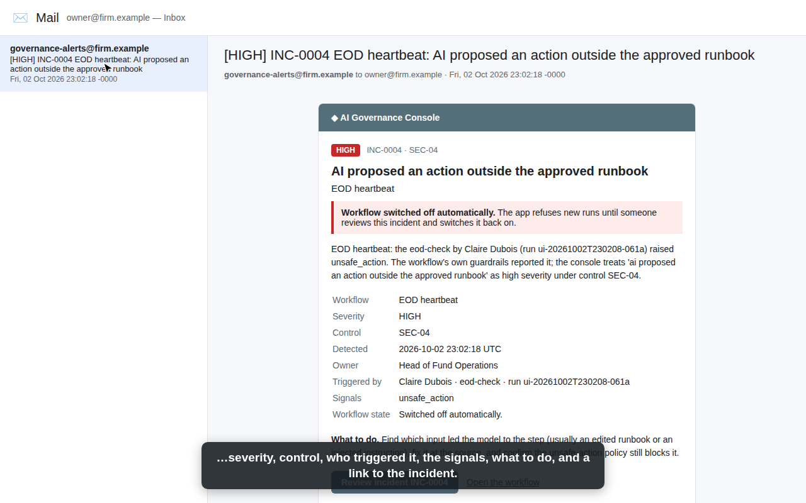

# governance-console

**One place to see and control every AI workflow a firm runs: who uses each one, how often, what it costs, what
data flows through it, whether its controls are in place — and a switch to turn it off.**

> Part of the [AI Workflow Portfolio]({{SITE_URL}}) by Ruairi Powers ·
> Write-up: [{{BLOG_TITLE}}]({{SITE_URL}}/blog/governance-console/) · Live demo: [try it]({{DEMOS_URL}}/governance-console/) ·
> Governance: [standard]({{SITE_URL}}/blog/governance/) / [this project's mapping](docs/governance.md)

   


## What it does

Once a firm has more than a couple of AI workflows, simple questions get hard. What is running? Who used it this
week? What did it cost, and why did that jump? Are its controls actually in place, and who last checked? How do I
stop it *now*?

Every workflow in this portfolio ships the same small telemetry client (`clients/python/telemetry.py`). It sends one
event per visit and per action — a triage run, an investigation, an approval, a question, an end-of-day check, an
eval — with the person or service, model, tokens, cost, latency, records in and out, outcome and safety flags.
Never prompts, questions or documents. The console turns those events into:

| Page | What you get |
|---|---|
| **Overview** | KPI tiles (spend, runs, active users, human decisions, tokens, records processed, escalation rate, p95 latency) with change vs the previous period; **daily AI spend by workflow** and **cumulative spend**; runs per day; data throughput; every workflow with state, risk tier, owner, budget use, escalation and error rates, control coverage and attestations; safety signals; spend by model; live activity; kill-switch changes |
| **Workflow** | The same charts for one workflow, its owner and risk rationale, who ran it, spend by model, the **kill switch**, and all 30 controls with the project's own mapping, **live evidence** from events and **attestations** |
| **Controls** | Matrix of workflows × controls from each project's `docs/governance.md`, with attestation state |
| **Models** | Every registered model per workflow: aliases in use, approved, priced, deprecation date, usage |
| **Events & people** | Who ran what and when, filterable, with CSV export |
| **Incidents** | Every governance issue the console detected — evidence, guidance, timeline, auto-shutdown, emails, and the documented resolution |
| **Audit & alerts** | Kill-switch log, spend anomalies, and **unregistered workflows** sending AI usage (shadow AI) |
| **Settings** | Per workflow: email alerts on or off, recipients, the severity that emails, the severity that **switches it off automatically**, which rules apply; plus the outbox |

**New projects appear on their own.** The catalog is built from `portfolio.yaml`, each project's spec (owner, risk
tier) and its `docs/governance.md`. Add a project to the portfolio and it's governed — its controls, models and
budget show up before it has run once. A workflow that sends events without being in the catalog is flagged.

**The kill switch is enforced by the workflows, not just displayed.** Before every run or approval, each app asks the
console whether it's enabled (cached 15 s) and refuses with the reason if not, logging the attempt as *blocked*.
Changes need an admin and a reason and are audited. In the public demo anyone can try it — the switch-off lapses
after 10 minutes so the demos stay usable.

**Governance issues are escalated.** When a workflow reports something a rule treats as a governance issue — an
AI-proposed action outside the runbook, restricted content reaching someone, a payment-detail change request,
an injection, a failed eval or data gate, a budget or spend anomaly, an unregistered workflow — the console opens an
incident. At or above the workflow's auto-shutdown level it switches the workflow off; at or above its notify level
it emails the escalation list with the details and a link straight to the incident. There you investigate, record
the root cause, the fix and where it's documented, re-confirm the control and switch the workflow back on, in one
step. One open incident per workflow and rule means one email, not a flood. Ticketing (PagerDuty, ServiceNow) is a
designed integration option: each incident page shows the exact payloads ([docs/integrations.md](docs/integrations.md)).

[](docs/img/escalation.mp4)

*Narrated walkthrough video (1 min 23 s, neutral Piper voice, [docs/img/escalation.mp4](docs/img/escalation.mp4)): a runbook is edited so the
model proposes a forced rerun → the policy blocks it and the console switches EOD heartbeat off → the owner's
email → the incident page → investigation note → approved runbooks restored → root cause, fix and documentation
recorded, SEC-04 re-confirmed, workflow re-enabled. Recorded against a local console and a local mail server; the narration is text-to-speech, and loads and waits are edited out ([docs/video](docs/video/README.md)).*

### Simulated history vs live events

The console seeds 90 days of **labelled simulated history** so the charts mean something on day one: 25 named
staff across four workflows, plus a story you can find in the charts — trade-ops promoting a larger model (daily
spend roughly triples, anomalies flagged, budget use passes the 80% warning), an injection-laden vendor batch, the CRO switching
research Q&A off for a day over a licence question, and an unregistered `pm-notes-summarizer` showing up in the last
week. Untick *Include simulated history* to see only **live events** from people using the demo apps. Simulated
costs use illustrative per-token rates, not vendor prices; live costs from the demos use the offline mock models'
simulated pricing.

## Quickstart

```bash
git clone <this repo> && cd governance-console
python -m venv .venv && source .venv/bin/activate
pip install -e ".[dev]"
govconsole serve                 # http://localhost:8600 (seeds the simulated history on first start)
pytest -q                        # 23 tests, incl. a round trip with the real telemetry client over HTTP
```

Point the workflows at it and use them — their events appear on the next refresh (untick *Include simulated
history* to see only yours):

```bash
export GOVERNANCE_URL=http://localhost:8600
altdata-triage all       # or: tradeops all · rqa ask "…" · eodhb all · any app's UI
```

Without `GOVERNANCE_URL` the workflows write to `~/.ai-portfolio/governance/events.jsonl`; a console on the same
machine imports that file automatically when you open it (`govconsole import-spool` does it by hand).

Try the kill switch locally: open a workflow's page, **Disable workflow** with a reason, then run that workflow —
it stops with *switched off by governance: \<reason\> (by \<you\>)*.

## Requirements

**Functional**

| ID | Requirement |
|---|---|
| FR-1 | Ingest one event per visit and action from every workflow (who, model, tokens, cost, latency, records, outcome, flags) |
| FR-2 | Show usage, spend (daily and cumulative), throughput and safety signals per workflow and in total, over a chosen period |
| FR-3 | Kill switch per workflow: admin-only, reason required, audited; workflows enforce it before every run |
| FR-4 | Controls matrix from each project's governance mapping, with live evidence and reviewer attestations |
| FR-5 | Pick up new workflows automatically; flag event sources that aren't registered |
| FR-6 | Escalate governance issues per workflow settings: incident, optional auto-shutdown, email with a link to the details; resolution records root cause, fix and documentation |

**Non-functional**

| ID | Requirement | Target |
|---|---|---|
| NFR-1 | Telemetry never blocks or breaks a workflow | background send, local spool fallback |
| NFR-2 | Least privilege | apps hold an append-only ingest token, never database credentials |
| NFR-3 | Kill-switch propagation | ≤ 15 s to every app |
| NFR-4 | Dashboard speed | 90 days × all workflows renders in < 1 s on a laptop (measured: pages 20–90 ms over ~7,000 events) |
| NFR-5 | Data minimization | no prompts, questions or documents — counts, hashes and flags only |

## Use-case card (HITL-04)

| | |
|---|---|
| **Intended use** | Oversight of AI workflows: usage, spend, control coverage and evidence, attestations, kill switch. |
| **Not for** | Approving individual AI outputs (each workflow keeps its own human-in-the-loop); security monitoring of the apps' infrastructure. |
| **Risk tier** | Low — no model calls. The kill switch is the one consequential action: admin-only, reasoned, audited. |
| **Owner** | Chief risk officer (business) · AI platform team (technical) |
| **Known limits** | Evidence is what workflows report — a workflow that doesn't send events is invisible except via the catalog; admin is a shared token (SSO in production); the hosted demo's live history is lost on restart unless `DATABASE_URL` points at Postgres; budgets are trailing-30-day, not calendar-month. |

## Architecture

See [docs/architecture.md](docs/architecture.md) for the flow, the switch-off sequence, the telemetry contract and
the design decisions; [docs/aws-native.md](docs/aws-native.md) for App Runner + Aurora + Firehose/S3 + AppConfig.

```
clients/python/telemetry.py   the client every workflow ships (kept identical by the portfolio's CI)
catalog/workflows.json        bundled catalog for a standalone console (regenerated by scripts/build_catalog.py)
config/settings.yaml          ingest limits, kill switch, alert thresholds, attestation window, simulation
config/workflows.yaml         owners and monthly budgets per workflow
src/govconsole/
  app.py        FastAPI: pages, ingest API, status API, admin, attestations
  catalog.py    builds the catalog from the portfolio (projects, specs, governance mappings, models)
  metrics.py    KPIs, daily series, budgets, anomalies, actors, control evidence
  escalation.py rules → incidents → auto-shutdown → notifications; resolution
  notify.py     the alert email, SMTP delivery, PagerDuty / ServiceNow payloads (design)
  store.py      events · workflow_state · control_changes · attestations · workflow_meta · incidents ·
                incident_log · notifications · escalation_settings (SQLite or Postgres)
  simulate.py   labelled 90-day history
  templates/ static/   server-rendered pages, Chart.js (vendored)
infra/aws/      Terraform starter (App Runner, Aurora Serverless v2, Secrets Manager, S3 Object Lock, AppConfig, Budgets)
```

## Configuration

| What | Where |
|---|---|
| Ingest token (workflows send it) | `GOVERNANCE_INGEST_TOKEN` (unset = open, local only) |
| Admin token (switches, attestations) | `GOVERNANCE_ADMIN_TOKEN` (unset = admin open locally, off in the hosted demo) |
| Durable store | `DATABASE_URL=postgresql://…` (`pip install '.[postgres]'`) |
| Owners and budgets | `config/workflows.yaml` |
| Budget warning, anomaly factor, attestation window, demo switch-off length | `config/settings.yaml` |
| Escalation rules, severities, defaults, email cap | `config/escalation.yaml`; per-workflow choices on the **Settings** page |
| Alert email | `SMTP_HOST`, `SMTP_PORT`, `SMTP_USER`, `SMTP_PASSWORD`, `SMTP_FROM`, `GOVERNANCE_ALERT_EMAIL`; link base `GOVERNANCE_PUBLIC_URL` |
| Workflow side | `GOVERNANCE_URL`, `GOVERNANCE_INGEST_TOKEN`, `GOVERNANCE_FAIL_CLOSED=1`, `GOVERNANCE_TELEMETRY=off` |

Behind a path prefix (e.g. `https://demos.example.com/governance-console/`) set `ROOT_PATH=/governance-console`;
the portfolio's deploy scripts do this. On Hugging Face, sign in as admin on the Space's direct URL
(`https://<owner>-governance-console.hf.space`): the admin cookie isn't sent inside the huggingface.co page's iframe.

## License

MIT. All people, events and costs in the simulated history are invented. Chart.js is MIT-licensed
(`src/govconsole/static/vendor/chart.js.LICENSE.md`).
