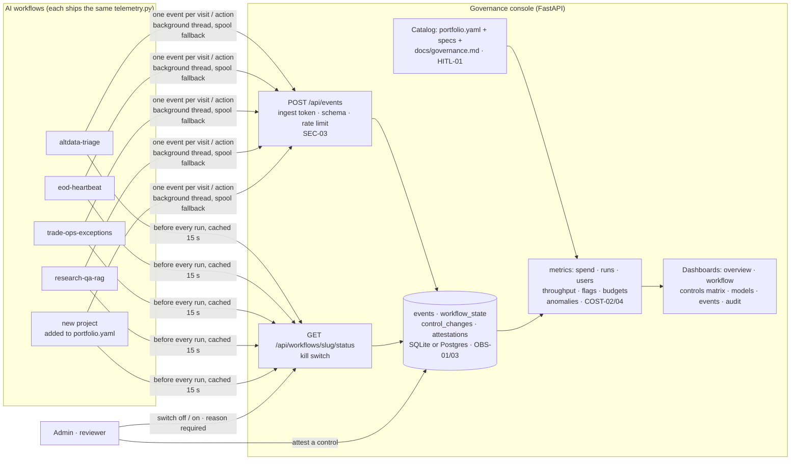
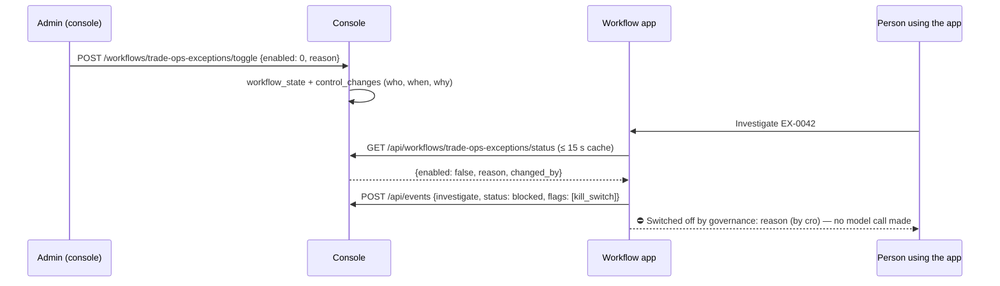
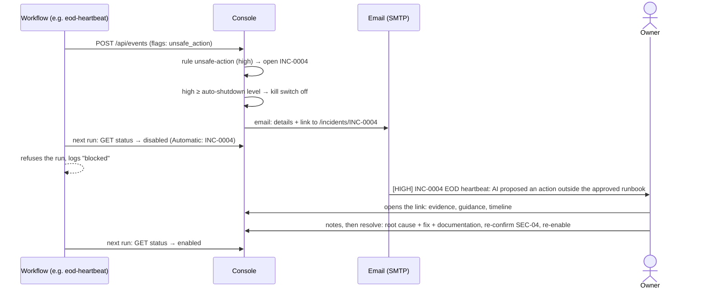

# Architecture — governance-console

## Flow

<!-- --8<-- [start:flow] -->

<!-- --8<-- [end:flow] -->

## Sequence: a workflow is switched off

## Sequence: a violation is escalated

Rules live in `config/escalation.yaml` (flag rules fire on ingest; budget, anomaly and shadow-AI rules every five
minutes). Per-workflow recipients and levels are on the Settings page. Ticketing is designed in
[integrations.md](integrations.md).

## Telemetry contract

One JSON event per visit or action. No prompts, questions, documents or answers — counts, hashes and flags only.

| Field | Meaning |
|---|---|
| `event_id` | idempotency key (re-sending an event never double-counts) |
| `ts`, `workflow`, `event_type`, `status` | when, which workflow, what happened (`triage`, `investigate`, `ask`, `eod-check`, `approve`, `visit`, `register` …), outcome (`ok`, `escalated`, `refused`, `blocked`, `error` …) |
| `actor`, `actor_type`, `session_id` | a named person, an anonymous demo visitor, or a service (scheduler, agent) |
| `model`, `input_tokens`, `output_tokens`, `cost_usd`, `latency_ms` | what the run consumed — the workflow's own budget code computes cost |
| `records_in`, `records_out` | throughput: rows / documents / tool results read, outputs produced |
| `flags` | safety and control signals: `injection_detected`, `escalated`, `budget_blocked`, `entitlement_filtered`, `kill_switch`, `human_override` … |
| `environment`, `app_version` | `demo`, `local`, `ci`, `prod`; client version |

## Why this shape

<!-- --8<-- [start:decisions] -->
| Decision | Chosen | Why | Alternatives considered |
|---|---|---|---|
| Transport | HTTP push to an ingest API, with a local spool file as fallback | Apps hold an append-only token, never database credentials, so a compromised app can't rewrite history or flip a switch. Works across separately hosted demos with no shared database. | Apps write to a shared Postgres (simpler, but every app can write every table); OpenTelemetry collector → vendor backend |
| Telemetry client | One small file copied into every workflow, kept identical by a CI check | No shared package to version and publish; each project repo stays standalone. | Shared PyPI package; OpenTelemetry GenAI semantic conventions (a good next step) |
| Kill switch | Polled by the app before every run, enforced in the code path, fail-open by default | The switch has to stop the model call, not just grey out a button. Fail-open keeps a console outage from stopping the business; `GOVERNANCE_FAIL_CLOSED=1` for high-risk workflows. | Feature-flag service (AWS AppConfig, LaunchDarkly); push via webhook |
| Catalog | Read from the portfolio repo (portfolio.yaml, specs, each `docs/governance.md`) | A new project is governed the moment it's added — owner, risk tier and control mapping come from files the project already has. Unknown event sources are flagged as shadow AI. | Hand-maintained registry; ServiceNow / Collibra AI inventory |
| UI | Server-rendered HTML + Chart.js (vendored) | Fast, dependency-light, no build step; a contrast with the Streamlit apps it governs. | Grafana / Datadog dashboards over the same events; Streamlit; React |
| Store | SQLite, Postgres via `DATABASE_URL` | Zero-infra locally; durable and shared when hosted. Same SQL on both. | ClickHouse / DuckDB for high event volumes; S3 + Athena (see AWS) |
| Demo history | 90 days of labelled simulated events, hideable with one toggle | The dashboards mean something on day one; live events are always distinguishable. | Empty dashboards until people use the demos |
<!-- --8<-- [end:decisions] -->
