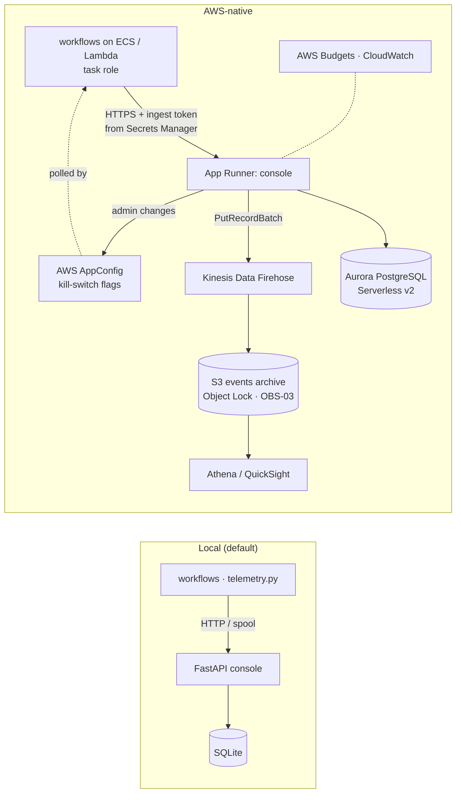

# Running the governance console AWS-native

Locally the console is one FastAPI process with SQLite. In AWS the same container runs on **App Runner** (or ECS)
with **Aurora PostgreSQL Serverless v2** behind `DATABASE_URL`. For a firm with many workflows, events also stream
through **Kinesis Data Firehose** to **S3** (Object Lock) and are queried with **Athena**, and the kill switch can
move to **AWS AppConfig** feature flags so workflows read it without depending on the console being up.



| Concern | Local | AWS-native | Change required |
|---|---|---|---|
| Console | `govconsole serve` | App Runner service from the ECR image (`Dockerfile`) | `docker build`, push to ECR, `terraform apply` |
| Event store | SQLite `warehouse/console.sqlite` | Aurora PostgreSQL Serverless v2 | `DATABASE_URL` from the RDS-managed secret; `pip install '.[postgres]'` |
| Long-term archive | — | Firehose → S3 (Object Lock, governance mode) → Athena | Add a Firehose put in `ingest` (not built) |
| Ingest / admin tokens | env vars | Secrets Manager, injected into App Runner and the workflow tasks | `terraform apply` creates both secrets |
| Kill switch | `workflow_state` table, polled by apps | Same, or AppConfig feature flags (apps read via the AppConfig agent; works when the console is down) | Swap `telemetry.status()` to read AppConfig (not built) |
| Identity | admin token cookie | IAM Identity Center / Cognito in front of App Runner; admin = a governance group | Not built |
| Spend alerts | budgets in `config/workflows.yaml` | Same, plus AWS Budgets on each workflow's cost-allocation tag | `terraform apply` |

## Steps

```bash
cd infra/aws && cp terraform.tfvars.example terraform.tfvars   # region, owner, alert email, image URI
terraform init && terraform plan                               # review before apply
# Then set GOVERNANCE_URL (the App Runner URL) and the ingest-token secret on every workflow's task definition.
```

## Status and honest gaps

- **Works today:** the container, the Postgres code path (`DATABASE_URL`), token-protected ingest, admin-only switches.
- **Not built:** Firehose archive writes, AppConfig-backed kill switch, SSO in front of the UI.
- **Not validated against a live account** — run `terraform validate` / `plan` first.

## Other options (not implemented)

| Layer | Option |
|---|---|
| Dashboards | Grafana (Amazon Managed Grafana) or Datadog over the same events, via OpenTelemetry GenAI spans |
| Inventory | ServiceNow AI inventory / Collibra as the system of record for the catalog |
| Azure / GCP | Container Apps + Azure Database for PostgreSQL + App Configuration · Cloud Run + Cloud SQL + Firebase Remote Config |
