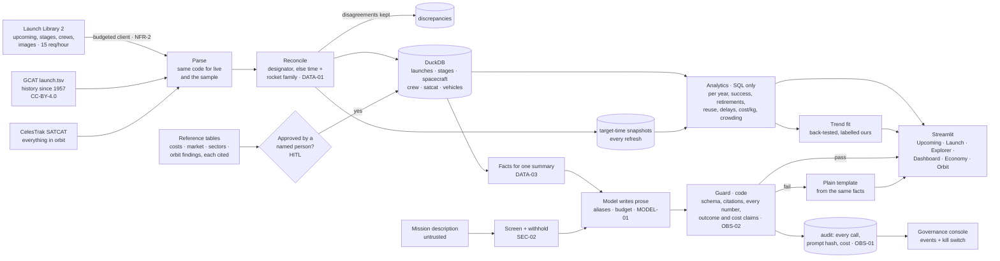

# Architecture — launch-tracker

## Flow

<!-- --8<-- [start:flow] -->

<!-- --8<-- [end:flow] -->

## A summary, step by step

<!-- --8<-- [start:sequence] -->
```mermaid
sequenceDiagram
    participant U as You
    participant App as App / CLI
    participant Gov as Governance console
    participant DB as DuckDB
    participant LLM as Model (alias)
    participant G as Guard (code)
    U->>App: Summarise this launch
    App->>Gov: enabled? (kill switch, cached 15 s)
    App->>DB: launch, stages, crew, approved cost (SQL)
    App->>App: facts = only the fields a summary needs; description screened, withheld if it has instructions
    App->>LLM: prompt v1 + facts (+ description, delimited)
    LLM-->>App: JSON {text, citations}
    App->>G: parse, check citations, numbers, outcome and cost claims
    alt every claim matches the rows
        G-->>U: summary (model, checked)
    else anything doesn't
        G-->>U: plain sentence from the same facts + why the draft was rejected
    end
    App->>DB: audit row (model, prompt hash, tokens, cost, flags)
    App->>Gov: one event (counts and flags only)
```
<!-- --8<-- [end:sequence] -->

## Decisions

<!-- --8<-- [start:decisions] -->
| Decision | Chosen | Alternatives | Why |
|---|---|---|---|
| Sources | Launch Library 2 + GCAT + SATCAT | One API only; scraping news sites | LL2 has the detail and the future, GCAT the authoritative past, SATCAT what's up there now. All three are free and public; no scraping |
| History | GCAT for everything, LL2 detail where it exists, matched by designator or time + rocket family | Trust one source | The sources disagree occasionally; a reconciled model shows the disagreement instead of hiding it |
| Rate limit | A request budget in the database, shared by every caller; resumable history backfill | Sleep between calls | 15 requests an hour is tiny: a budget that refuses the 16th call is the only reliable way to stay polite |
| Delays | Measured: every refresh records each launch's target time | Report "delayed" flags from the source | Sources overwrite the target time; slips only exist if you keep the history |
| Costs | A curated table, each row cited, used only after a person approves it; otherwise "not public" | Let a model estimate | Launch prices are rarely published; an estimate looks like a fact |
| Images | Shown only with a recorded licence and credit | Show whatever the source links | Many source images carry "Unknown" licence |
| Projection | A simple log-linear trend, back-tested and labelled ours; third-party projections beside it, labelled theirs | A model "forecast"; blending the two | A fit you can back-test is honest; mixing someone else's market sizing into it isn't |
| Model's job | Prose only, from SQL facts; code checks every number | Let the model answer questions over the data | Every number on screen must trace to a row |
| Storage | DuckDB, rebuilt into a copy and swapped in atomically | Postgres | One file, fast analytics, no server; readers never see a half-written refresh |
| Scheduling | Prefect flows (optional) or a plain loop in the demo | Airflow, cron | Prefect is new to the portfolio and light enough for a personal project; the loop keeps the demo image small |
<!-- --8<-- [end:decisions] -->

## Data model

| Table | One row per | From |
|---|---|---|
| `launches` | launch (merged across sources) | LL2 + GCAT |
| `stages` | rocket stage flown (serial, flight number, landing) | LL2 |
| `spacecraft` | spacecraft flown (capsule, destination, return, splashdown) | LL2 |
| `crew` | seat (name, role, agency) | LL2 |
| `net_snapshots` | launch × refresh (target time seen) | this app |
| `vehicles` | rocket (first/last launch, count) | derived |
| `satcat` | catalogued object | SATCAT |
| `discrepancies` | field on which LL2 and GCAT disagree | reconciliation |
| `reference_reviews` | approval or rejection of a cost/reference row | a person |
| `audit.ai_calls`, `audit.summaries` | model call, summary | this app |
