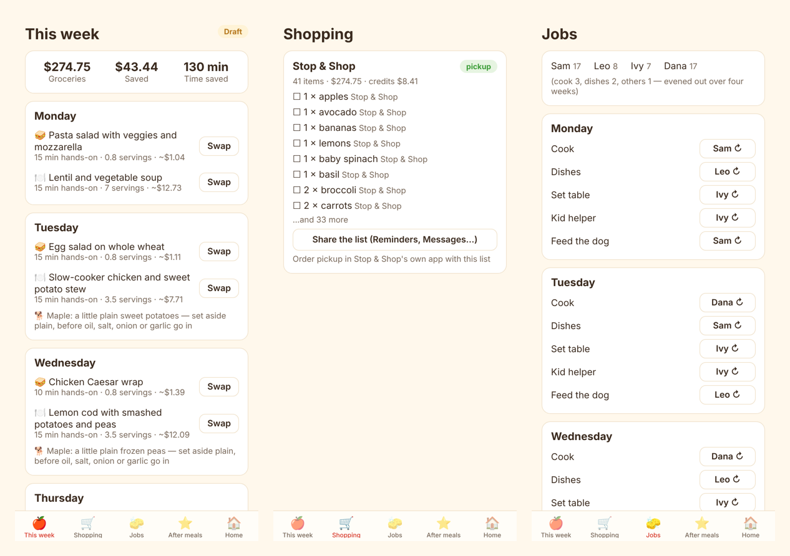

# Lil'Helper


**A family meal planner that picks the week's meals, splits the shopping across stores by price and specials, shares
the cooking and cleanup, and learns how much everyone — the dog included — actually eats.**

> Part of the [AI Workflow Portfolio]({{SITE_URL}}) by Ruairi Powers · a personal project ·
> Write-up: [{{SITE_URL}}/personal/lil-helper/]({{SITE_URL}}/personal/lil-helper/) ·
> Governance: [this project's mapping](docs/governance.md)

## What it does

- **Plans the week** for the meals you turn on (dinners every night, weekend breakfasts, school lunchboxes), from
  recipes the family likes plus two new ideas a week. A solver fits everyone's allergies and diets (hard rules), each
  day's hands-on cooking limit, variety, the season where you live, the budget and this week's specials. Swap any
  meal; the rest of the week stays put.
- **Splits the shopping** across Whole Foods, Trader Joe's, Costco, Stop & Shop (or your stores) by shelf price,
  specials, pickup and delivery fees, delivery markups, and membership and card credits — three ways: cheapest,
  balanced (your time is worth something), fastest.
- **Hands each list to the app that already does it:** an Instacart shopping-list link, a list shared to the Whole
  Foods app or Reminders, an aisle-ordered list for Trader Joe's (which doesn't sell online). Nothing is bought by
  Lil'Helper; an adult approves the week first.
- **Shares the jobs:** cook, dishes, set the table, kid helper, feed the dog — fair over four weeks, by who's home
  and what each age can do.
- **Feeds the dog:** restocks its food with the groceries, and sets aside plain, dog-safe extras from dinner (capped
  at 10% of its daily calories). Grapes, onion, garlic, chocolate, xylitol and anything your vet named are blocked.
- **Keeps everyone in the loop:** a Sunday email, a Google Calendar feed, weekly and monthly fridge calendars (PDF).
- **Learns:** after each meal, one tap for how much was eaten and a rating. Portions adjust; the savings report
  shows dollars, minutes and satisfaction against a stated baseline.
- **Specials from a flyer photo:** a vision model reads it; a person confirms before it counts; typo prices are flagged.

The family uses the **phone app** (`app/`, Expo — iPhone first via TestFlight, Android from the same code).

 The
**Streamlit demo** shows the same engine on a fictional family.

## Quickstart

```bash
pip install -e ".[ui,dev]"
helper plan                   # one week for the fictional Rivera family, offline mock model
helper simulate --weeks 4     # draft → approve → meal feedback → portions learn, four times
helper eval                   # golden-set gate (allergens, dog safety, constraints, shopping, injection)
helper ui                     # Streamlit demo: input → run → output
helper serve                  # the API the phone app talks to (http://localhost:8650)
pytest -q
cd app && npm install && npx expo start     # the phone app (Expo Go, or press w for web)
```

Your own household: copy `config/household.example.yaml` to `config/household.yaml` (git-ignored — children's names
never go in a public repo) and edit people, pets, meals, prep limits, budget, stores, memberships and cards (names
only). Prices and specials: `data/prices.yaml` and flyer photos in the app.

## Results (offline, mock model, fictional family, synthetic prices)

Eight simulated weeks (`helper simulate --weeks 8`):

| Measure | Result |
|---|---|
| Dollars saved vs the home store at regular prices, one trip | $184.82 over 8 weeks ($23.10 a week; 17% of the baseline) |
| Minutes saved a week | ~121, of which ~73 is the family's own estimate of planning time before (75 min) minus 1–2 min approving, and the rest a pickup instead of a store trip |
| Plans with an allergen for someone eating | 0 of 8 weeks |
| Dog extras held back | 8 (toxic, or not on the dog-safe list) |
| Adults' job load over 8 weeks | 132 and 132 (cook 3, dishes 2, others 1) |
| Average meal rating | 4.15 / 5 (simulated reactions from the family's likes and dislikes) |
| Model cost | $0.042 for 8 weeks (simulated pricing; $0 on local models) |
| A week's plan, split and jobs | 1–5 s |

Eval gate: 16 of 16 cases, must-reject recall 1.00 (hidden allergens in model ideas and household recipes, dog-toxic
foods and vet notes, a $0.09 "special", an instruction hidden in a flyer, a card number).

What the numbers rest on: the prices, specials and fees are synthetic; with these prices the balanced option always
chose one store (Stop & Shop pickup) and only the cheapest option split across three. The ratings and leftovers come
from a simulated family, so "food left over" moves around (0–8% a week) rather than showing a clean trend. Time saved
is mostly the household's own before-estimate. Real numbers need real weeks.

## Configuration

| What | Where |
|---|---|
| People, allergies, diets, likes, portions; pets, food, vet notes | `config/household.yaml` `people`, `pets` |
| Meals to plan, leftovers nights, lunchboxes | `meals` |
| Hands-on minutes per day, batch-cooking day | `prep_minutes`, `batch_day` |
| Health preferences (veg, fish, vegetarian nights, fried, repeats) | `health` |
| Brands, organic, banned items | `brands` |
| Stores, home store, memberships, cards (names only) | `stores`, `home_store`, `memberships`, `cards`; fees in `config/stores.yaml`, credits in `config/money.yaml` |
| Jobs, ages, fairness window | `chores` |
| Email day and time, calendar, printouts | `outputs` |
| Solver weights, typo-special threshold, dog extras cap, portion learning | `config/settings.yaml` |
| Models | `config/models.yaml` (aliases `helper-suggest`, `helper-vision`, `helper-notes`, `helper-fallback`, `helper-candidate`) |

## Use-case card (HITL-04)

| | |
|---|---|
| **Intended use** | One household planning its own meals, shopping and kitchen jobs. |
| **Not for** | Medical or clinical nutrition (health settings are preferences, not advice); veterinary advice (follow your vet); buying anything automatically. |
| **Risk tier** | Medium: children's data, allergies, a dog, and real spending (through a person). |
| **Owner** | Ruairi Powers |
| **Known limits** | Allergen safety depends on the ingredient list and its synonyms being complete — check labels. Prices are only as good as what the household enters or photographs; there is no live price feed. Instacart chooses which store a link opens (the list asks for the right one). Trader Joe's is in-store only. The mock model is a stand-in. |

## Architecture

See [docs/architecture.md](docs/architecture.md), [docs/governance.md](docs/governance.md) and
[docs/aws-native.md](docs/aws-native.md). The phone app: [app/README.md](app/README.md).

## License

Apache-2.0, by Ruairi Powers, built with Claude: keep the NOTICE file and credit the project if you reuse it (see [NOTICE](NOTICE)).
