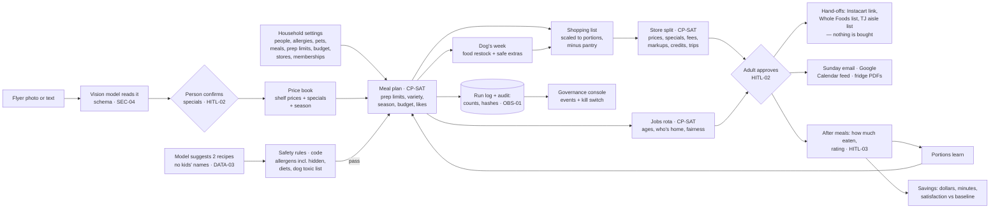
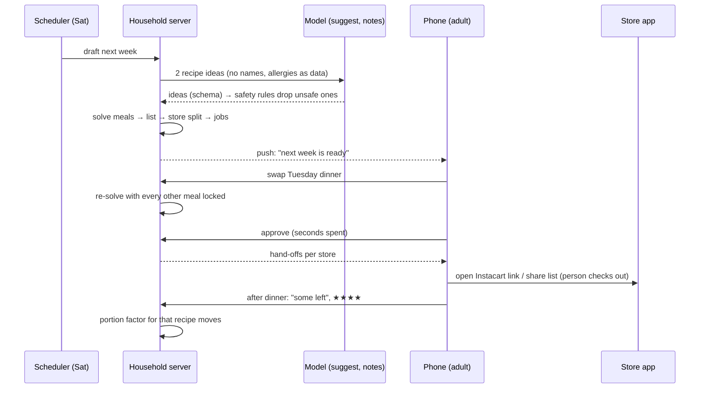

# Architecture — Lil'Helper

## Flow

<!-- --8<-- [start:flow] -->

<!-- --8<-- [end:flow] -->

## A week in the app

<!-- --8<-- [start:sequence] -->

<!-- --8<-- [end:sequence] -->

## Why this shape

<!-- --8<-- [start:decisions] -->
| Decision | Chosen | Alternative | Why |
|---|---|---|---|
| Who chooses meals and stores | A constraint solver (OR-Tools CP-SAT) in code | Ask a model for a meal plan | Allergies, prep limits, budget and fees are hard rules with numbers; a solver either meets them or says it can't. The model suggests recipes and writes one-line notes, inside a schema |
| Allergies and the dog | Hard rules in code with hidden-source synonyms ("satay" → peanut, "pesto" → tree nut) and a dog-toxic word list; vet notes blocked the same way | Trust the model to avoid them | A wrong plan can make someone ill. Rules run on every plan, idea, special and dog extra, and a model can't override them |
| Buying | Hand off to the app that already does it: Instacart shopping-list link (Developer Platform), a list shared to the Whole Foods app or Reminders, an aisle-ordered Trader Joe's list | Place orders from Lil'Helper | Integrate, don't rebuild; and nothing spends money without a person tapping through |
| Specials | A flyer photo the household takes, read by a vision model, confirmed by a person; typo prices flagged | Scrape store websites | Store terms of service; Trader Joe's has no online store or sales; a confirmed special is a fact, a scraped one is a guess |
| Calendar | An .ics feed subscribed to once in Google Calendar | A calendar inside the app | The family already lives in Google Calendar |
| The phone app | Expo (React Native): iPhone via TestFlight first, Android from the same code | Native Swift; a web app on the home screen | One codebase for both phones, real push and secure storage, no Mac needed to build (EAS) |
| Where data lives | The household's own server (the EVO-X1), SQLite | A hosted multi-tenant service | Children's names, ages and what everyone eats stay at home; the public demo uses a fictional family |
| Reproducibility | One solver worker, fixed seeds | Parallel search | The same inputs give the same plan, so a test or a savings number can be repeated (at ~6 s a week, inside the 10 s target) |
<!-- --8<-- [end:decisions] -->

## What's next

- **Real models on the EVO-X1:** `local-qwen` for ideas and notes, a local vision model for flyers; run
  `helper eval --alias helper-candidate` and promote only on a pass.
- **Instacart for real:** a Developer Platform key on the household server turns the Costco and Stop & Shop
  lists into one-tap links (Instacart chooses the store shown; the instructions ask for the right one).
- **Push notifications** when the plan is ready (Expo push; needs the EAS project id).
- **Google Calendar API** push instead of a feed, if a feed's refresh delay ever matters.
