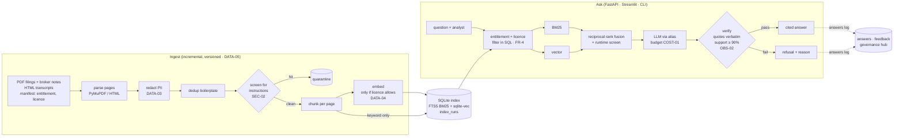
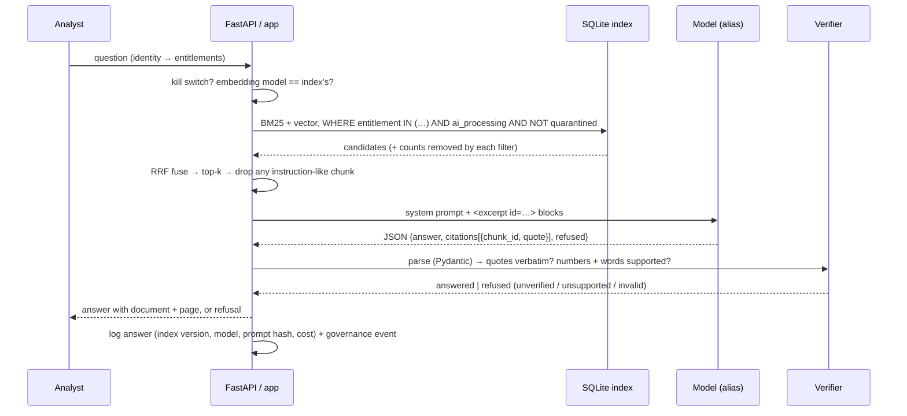
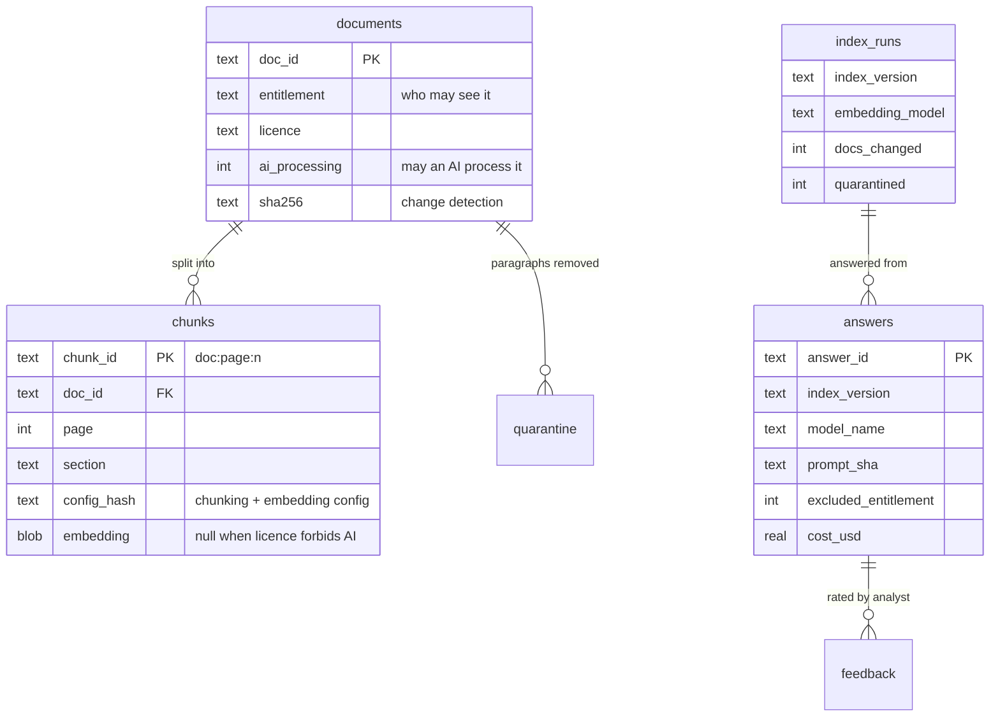

# Architecture — research-qa-rag

## Flow

<!-- --8<-- [start:flow] -->

<!-- --8<-- [end:flow] -->

## Sequence: one question

## Why this shape

<!-- --8<-- [start:decisions] -->
| Decision | Chosen | Why | Alternatives considered |
|---|---|---|---|
| Pattern | RAG, single model call | The question needs documents, not tools or multi-step planning. One call is cheaper, faster and easier to audit. | Agentic retrieval (query rewriting, multi-hop), fine-tuning |
| Retrieval | Hybrid: BM25 + vectors fused with RRF | Financial questions are full of exact terms (tickers, "net revenue retention", "$3.9 billion") that keyword search nails and embeddings blur; vectors catch paraphrase. RRF needs no score calibration. Measured: hybrid has the best MRR on the golden set. | Vector only; learned reranker (Cohere / bge-reranker); Bedrock KB hybrid |
| Store | One SQLite file: FTS5 + sqlite-vec | Zero infrastructure, exact search, filters in plain SQL, and a per-visitor copy in the hosted demo. Exact (brute-force) vector search is fine for tens of thousands of chunks; beyond that, use an ANN index. | Postgres + pgvector (see eod-heartbeat), OpenSearch, Qdrant, Bedrock Knowledge Bases |
| Access control | Entitlement filter inside both retrievers' WHERE clauses | A chunk the user can't see is never scored, fused or sent — not filtered afterwards. Refusals don't reveal restricted documents. | Post-filtering results; one index per entitlement group |
| Licences | `ai_processing` per document; barred documents are keyword-indexed but never embedded or sent to a model | The analyst may read the note; the licence forbids third-party AI. Embedding APIs are third-party AI too. | Excluding the document entirely; legal review per question |
| Injection | Screen paragraphs at ingest (quarantine) and retrieved chunks at query time | Hidden text in PDFs is the classic indirect injection. Removing it before the model sees it beats asking the model to ignore it. | LLM classifier (Llama Guard, Bedrock Guardrails prompt-attack filter) |
| Grounding | Verbatim quote check + support ratio on every answer | A citation that doesn't match the source is worse than no answer. Deterministic, free, runs on every call. | LLM-as-judge faithfulness (RAGAS) on a sample |
| Service | FastAPI + the same `ask()` in Streamlit and CLI | One code path; OpenAPI docs for integration. | Lambda handlers; LangServe |
| Offline models | Extractive mock + feature-hash embeddings | Deterministic CI and a free hosted demo that exercises every control. | Recorded real-model responses |
<!-- --8<-- [end:decisions] -->

## Data model

