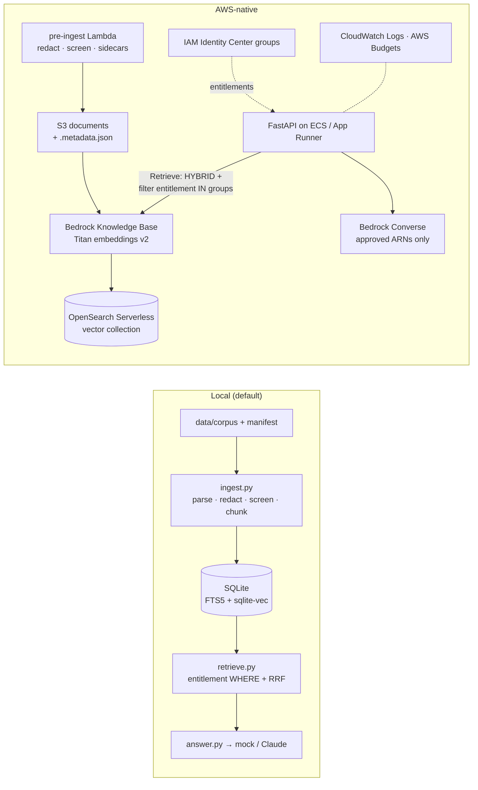

# Running research-qa-rag AWS-native

The local build keeps the whole index in one SQLite file. On AWS the managed equivalent is a **Bedrock Knowledge
Base** on **OpenSearch Serverless**: it parses, chunks, embeds and serves hybrid (keyword + vector) search with
metadata filters. The answer step, the verification and the governance code stay the same.



| Concern | Local | AWS-native | Change required |
|---|---|---|---|
| Documents + provenance | `data/corpus/` + `manifest.yaml` | S3 with a `<file>.metadata.json` sidecar per document (`entitlement`, `licence`, `company`, `doc_type`, `published`) | Write sidecars from the manifest; `aws s3 sync` |
| PII redaction, injection screening, dedup | `ingest.py` | Same code in a pre-ingest step (Lambda or the ECS task) that writes the cleaned text to S3 before the KB syncs | Run `ingest.py`'s parse/redact/screen and upload text instead of raw PDFs |
| Chunking + embeddings | page-bounded ~90-word chunks, `mock-hash-384` | KB fixed-size chunking (300 tokens, 20% overlap) + Titan Text Embeddings v2 | `terraform apply`; start an ingestion job on the data source |
| Hybrid search | BM25 + vectors fused with RRF | `retrieve` with `overrideSearchType: HYBRID` | Replace `retrieve.retrieve()` with a `bedrock-agent-runtime.retrieve` call |
| Entitlements (FR-4) | SQL `WHERE entitlement IN (…)` in both retrievers | `vectorSearchConfiguration.filter = {"in": {"key": "entitlement", "value": [groups…]}}` — applied inside the search, not after | Map SSO groups → entitlement values in the API |
| Licence-barred documents (DATA-04) | keyword-indexed, never embedded or sent to a model | **Not uploaded to the KB** (embedding them is AI processing); keep them in a separate keyword-only OpenSearch index if analysts need to find them | Filter by `ai_processing` before upload |
| Answer model | `answer-primary: mock-extractive` | Bedrock Converse | Set `bedrock-claude.model_id` + pricing, eval, `promote` |
| Index versioning (DATA-05) | `index_runs` + version on every answer | S3 versioning + KB ingestion-job IDs; record the job ID and data-source sync time on every answer | Log `ingestionJobId` with each answer |
| Run log | `answers` table | CloudWatch Logs (structured JSON) + governance console events | Set `GOVERNANCE_URL` to the governance console |

## Steps

```bash
cd infra/aws && cp terraform.tfvars.example terraform.tfvars
terraform init && terraform apply -target=aws_opensearchserverless_collection.kb \
  -target=aws_opensearchserverless_access_policy.kb      # collection first
# Create the vector index (name = var.vector_index_name) with fields embedding (knn_vector, 1024 dims for
# Titan v2), text and metadata — opensearch provider, awscurl or the console. Then:
terraform apply                                         # knowledge base, data source, API role, budget
aws s3 sync build/kb-docs s3://$(terraform output -raw docs_bucket)/
aws bedrock-agent start-ingestion-job --knowledge-base-id $(terraform output -raw knowledge_base_id) \
  --data-source-id $(terraform output -raw data_source_id)
```

## Status and honest gaps

- **Not validated against a live account**, and `terraform validate` hasn't been run (the build environment
  can't download Terraform). Run `validate` and `plan` first.
- **Not built:** the `bedrock-agent-runtime.retrieve` adapter, the pre-ingest Lambda and the sidecar writer.
  The local retriever is the reference behaviour, and the golden set is how you'd prove the KB version matches it.
- KB chunking is token-based and not page-bounded, so page citations need the page number carried in metadata
  (one source file per page) or a custom chunking Lambda.
- Licence-barred documents can't be in the KB at all, so the "you may read it, AI may not" refusal message needs
  a separate keyword index.

## Other cloud options (not implemented)

| Layer | Azure | GCP |
|---|---|---|
| Managed RAG | Azure AI Search (hybrid + semantic ranker) with security trimming filters | Vertex AI Search / RAG Engine |
| Models | Azure OpenAI | Vertex AI (Gemini, Claude) |
| Identity → entitlements | Entra ID groups | Cloud Identity groups |
