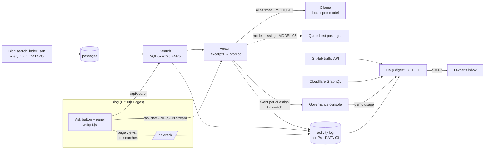

# Architecture — site-assistant

## Flow

<!-- --8<-- [start:flow] -->

<!-- --8<-- [end:flow] -->

## Why this shape

<!-- --8<-- [start:decisions] -->
| Decision | Chosen | Alternative | Why |
|---|---|---|---|
| Source of content | The blog's own MkDocs search index, fetched hourly | Crawling HTML, or indexing the repo's Markdown at build | What's indexed is exactly what's published, sections included, and needs no deploy coupling |
| Retrieval | SQLite FTS5 BM25, profile pages added for questions about Ruairi | Embeddings + vector search | A few hundred passages of technical prose; keyword search hits 1.00 on the golden set and needs no embedding model |
| Model | Local open model via Ollama on the home server | A hosted API | Free, and visitors' questions never leave the machine; the extractive fallback covers downtime |
| Logging | Query text as typed, no IPs, daily-rotating visitor hash | Full analytics (cookies, IPs) | The owner wanted to see searches; nothing else is needed for counts and uniques |
| Engagement email | One service collects first-party, console, Cloudflare and GitHub numbers daily | Separate dashboards per source | One email a day that's actually read; GitHub keeps only 14 days, so storing daily snapshots builds history |
<!-- --8<-- [end:decisions] -->
