# Architecture — speaking-coach

## Flow

```mermaid
flowchart LR
    T[Transcript<br/>paste · .txt .docx .srt .vtt<br/>meeting exports by speaker] --> I[Ingest<br/>turns, timing]
    W[Your word list<br/>presets + your words<br/>weights · rules · ignore] --> L[Lexicon<br/>matched literally · SEC-04]
    I --> D[Detect · code<br/>phrases, opener/closer,<br/>neighbour rules, repeats]
    L --> D
    I --> J[Injection scan<br/>flag only · SEC-02]
    D -->|clear hits| S[Score · code<br/>rate, grade, streaks, pace]
    D -->|unclear hits only| P[Pseudonymize<br/>names, emails, phones<br/>DATA-03]
    P --> M[Disambiguator model<br/>±8 words, schema · MODEL-01]
    M -->|confident| S
    M -->|unsure| Q[Disputed<br/>not counted]
    S --> W2[Worst sentences<br/>fillers marked]
    W2 --> P2[Pseudonymize] --> C[Coach model<br/>patterns + rewrites]
    C --> G[Guard · code<br/>no filler left, numbers<br/>and names kept, length]
    G -->|fail| C
    G -->|pass| R[Report<br/>names restored]
    S --> R
    Q --> H[Your call · HITL-02]
    H -->|recompute, no model| S
    H -->|save as test case| E[evals/feedback.yaml<br/>HITL-03]
    R --> O[(Run log: hashes and<br/>counts only · OBS-01)]
    R --> GC[Governance console<br/>event + kill switch]
```

<!-- --8<-- [start:flow] -->

<!-- --8<-- [end:flow] -->

## One run, step by step

<!-- --8<-- [start:sequence] -->
```mermaid
sequenceDiagram
    participant U as Speaker
    participant C as Code
    participant D as Disambiguator
    participant K as Coach
    U->>C: transcript + word list
    C->>C: detect every phrase, settle clear cases by rule
    C->>D: unclear hits only, ±8 words, placeholders for names
    D-->>C: {id, is_filler, confidence} (schema-checked)
    C->>C: count, rate, grade, streaks, pace
    C->>K: stats + worst sentences with fillers marked
    K-->>C: patterns + rewrites
    C->>C: guard each rewrite; retry failures once; drop if still failing
    C-->>U: report (names restored)
    U->>C: "that one wasn't a filler"
    C-->>U: new numbers (no model call)
```
<!-- --8<-- [end:sequence] -->

## Why this shape

<!-- --8<-- [start:decisions] -->
| Decision | Chosen | Alternative | Why |
|---|---|---|---|
| Who counts | Code, always; the model only settles unclear words and writes coaching | Ask a model to "find the filler words" | Same transcript, same score on every run and every model; a model can move a disputed hit, never a clear one |
| Telling filler from normal "like" | Readable position and neighbour rules first, a model for what's left | spaCy part-of-speech tags; a model for every hit | The rules settle most hits with no model and no download; each is a line you can read and test. spaCy is the documented next step |
| What a model sees | A few words around each unclear hit, with names, emails and phones as placeholders | The whole transcript | Transcripts are personal (meetings, interviews); the task needs context, not the document |
| Rewrites | Model drafts, code guards (no filler left, every number and name kept, length) and retries once | Trust the model, or no rewrites | Rewrites are the most useful output and the riskiest: a dropped "12%" changes what you said |
| Configuration | Presets + a pasted list (`phrase | category | weight | rule`) + ignore list + target | Fixed word list | Everyone's crutches differ ("to be honest", "basically" as a term of art); the list is the product |
| Storage | Nothing by default; opt-in SQLite history of numbers only | Save every transcript | Nothing to leak; progress tracking is still possible for those who want it |
| Audio | Not in v1: upload a transcript (Zoom, Teams, Otter, YouTube captions all export one) | Local Whisper in verbatim mode | Smaller, faster demo with no voice data; verbatim speech-to-text is the next step |
<!-- --8<-- [end:decisions] -->

## What's next

- **Audio in:** faster-whisper on the EVO-X1 in verbatim mode (most speech-to-text drops "um" by default, which
  defeats the point), with word timestamps feeding the pace and pause numbers.
- **Live buzzer:** the original word list was paired with a buzzer that flagged the seven words during meetings,
  with transcripts reviewed afterwards for repeats. A streaming version would run the same rules on partial
  transcripts and cover both.
- **spaCy tagging** for "like", "so" and "right" when the neighbour rules aren't sure.
