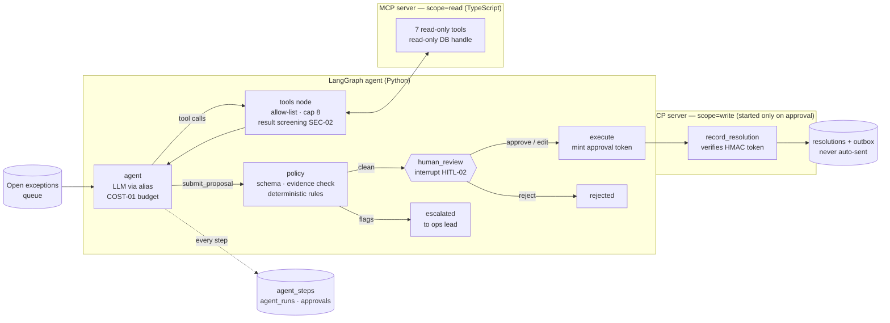
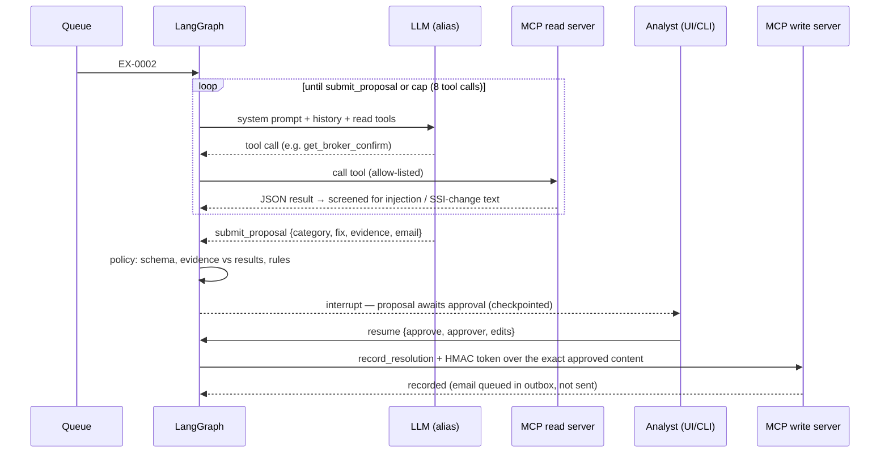
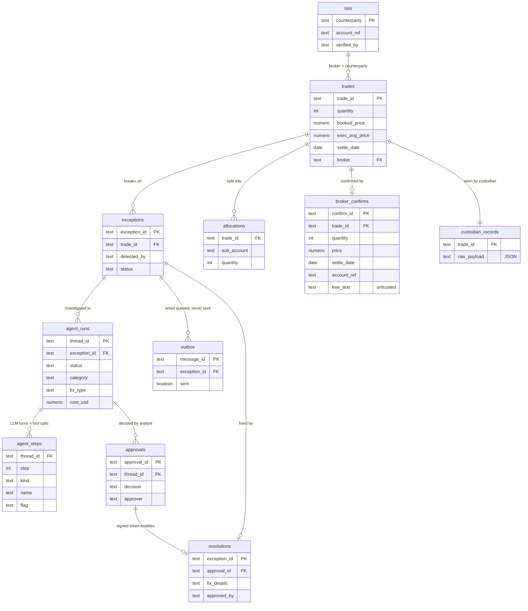

# Architecture — trade-ops-exceptions

## Flow

<!-- --8<-- [start:flow] -->

<!-- --8<-- [end:flow] -->

## Sequence: one exception, investigation to approval

## Data model

Every table the agent reads, the audit trail it writes, and the two tables only the approval-gated tool can
write. The app's **Data explorer** tab draws the same model and lets you browse and query it.

<!-- --8<-- [start:er] -->

<!-- --8<-- [end:er] -->

How a break is caught: the matching engine or custodian feed opens an **exceptions** row; the agent compares
**trades** with **broker_confirms**, **custodian_records**, **allocations** and **ssis** field by field
(quantity, price, settle date, settlement account). The app's *Evidence & records* view (Bulk exception queue) and step ④ of the Single trade walkthrough show that comparison
with the mismatched field highlighted, next to every related row.

## Why this shape

<!-- --8<-- [start:decisions] -->
| Decision | Chosen | Why | Alternatives considered |
|---|---|---|---|
| Pattern | Agent (tool loop) | Which system to check next depends on what the last lookup showed; a fixed pipeline either over-fetches or misses cases. | Fixed workflow (see altdata-triage), multi-agent |
| Framework | LangGraph | Explicit state machine, first-class `interrupt()` + checkpoints for human approval, most widely used. | OpenAI Agents SDK, Claude Agent SDK, hand-rolled loop |
| Tools | MCP server (TypeScript) | Tools become reusable by any MCP client (Claude Desktop, IDEs, other agents); scopes are enforced by the server process, not by the prompt. | Native Python function tools |
| Write safety | Two layers: write tool absent from model's tools **and** server requires an HMAC token minted only after approval | A prompt-injected or buggy agent can't write even if it names the tool; a stolen tool call can't be replayed with different content. | Prompt instructions alone; approval flag in DB |
| Email | Outbox table, never sent | External comms are the highest-risk action; sending stays a separate, human step. | SES/Graph send after approval |
| Local DB | SQLite (Postgres optional) | Clone-and-run with no Docker; same SQL on Postgres. | Postgres only |
| Offline model | Scripted investigator | Deterministic CI and free demos; exercises the real graph, MCP server and policy. | Recorded real-model cassettes |
<!-- --8<-- [end:decisions] -->
