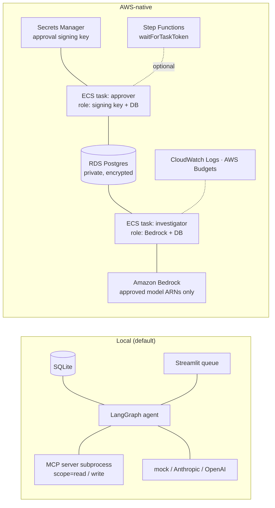

# Running trade-ops-exceptions AWS-native

Same Python package, MCP server, prompts, policy and evals. What changes is where each piece runs,
and who holds which permission.



| Concern | Local | AWS-native | Change required |
|---|---|---|---|
| Database | SQLite file | RDS Postgres | `DATABASE_URL=postgresql://…` (credentials from the RDS-managed secret); `pip install '.[postgres]'`, `npm i pg` |
| Model | `investigator-primary: mock-agent` | Bedrock | set `bedrock-claude.model_id` + pricing, `pip install '.[aws]'`, eval-gate, `promote` |
| Agent runtime | CLI process | ECS Fargate task (the Dockerfile image) | schedule `tradeops investigate` (EventBridge) |
| Approval | Streamlit / CLI on laptop | Approval task runs `tradeops approve`, triggered by your approval UI | approver identity from SSO, not a typed name |
| Signing key | `warehouse/.approval_key` or env | Secrets Manager, readable **only** by the approver role | inject as `APPROVAL_SIGNING_KEY` into the approver task |
| Audit | `agent_steps`, `agent_runs`, `approvals` tables | same tables in RDS + CloudWatch Logs | none |
| Budgets | `cost.*` | same + AWS Budgets forecast alert | set `monthly_budget_usd`, `alert_email` |

**Separation of duties.** The Terraform gives the investigator task permission to call Bedrock but not
to read the signing key. The approver task can read the key but cannot call any model. A compromised or
prompt-injected investigator therefore has no way to mint an approval, even inside AWS.

## Steps

```bash
cd infra/aws && cp terraform.tfvars.example terraform.tfvars   # VPC, subnets, model ARNs, email
terraform init && terraform plan                               # review before apply
docker build -t tradeops .     # then push to the ECR URL from `terraform output`
# In the task definitions: DATABASE_URL from the RDS secret; APPROVAL_SIGNING_KEY only for the approver task.
```

## Status and honest gaps

- **Works today:** the Postgres code path — the full investigate → approve → eval flow was run against
  Postgres 16, and CI has a Postgres job; Bedrock wiring through `langchain-aws` (`ChatBedrockConverse`).
- **Not exercised yet:** live Bedrock calls (needs an AWS account and model access) and the Docker image build. LangGraph checkpoints
  stay in a local SQLite file even on Postgres; `langgraph-checkpoint-postgres` is the drop-in for ECS.
- **Not built:** ECS task definitions and services, the Step Functions approval workflow, and an SSO-backed approval UI.
- **Not validated against a live account** — run `terraform validate` / `plan` first.
- **Also an option:** Amazon Bedrock AgentCore could host the agent and MCP tools as managed runtimes. This repo
  keeps them in a container so the same code runs locally.

## Other cloud options (not implemented)

| Layer | Azure | GCP |
|---|---|---|
| Runtime | Container Apps / AKS | Cloud Run |
| DB | Azure Database for PostgreSQL | Cloud SQL |
| Model | Azure OpenAI / AI Foundry | Vertex AI (incl. Claude) |
| Approval wait | Durable Functions | Workflows callbacks |
| Secrets | Key Vault | Secret Manager |
