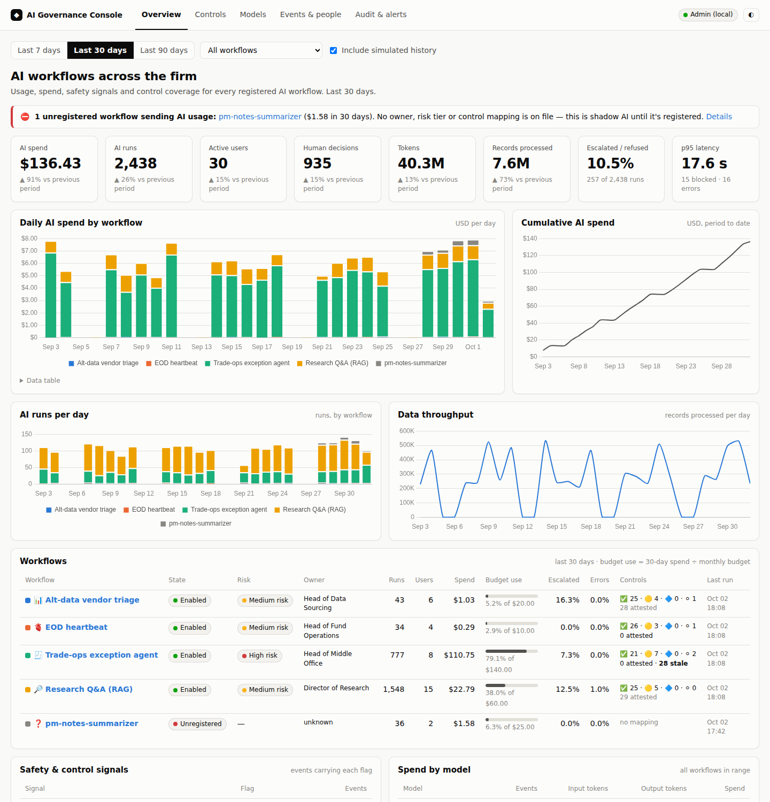

# One console for every AI workflow: usage, spend, controls and an off switch

The [governance standard](governance.md) says what every AI workflow must do. This project is how a CRO, a CTO or an
auditor checks that they do — across all of them, continuously, without asking each team for a spreadsheet. Every
workflow in this portfolio reports to it, and it can switch any of them off.

<!-- more -->

**Repo:** [github.com/{{GITHUB_OWNER}}/governance-console](https://github.com/{{GITHUB_OWNER}}/governance-console) · runs locally in two minutes ·
**Live demo:** [try it]({{DEMOS_URL}}/governance-console/) ·
**Try it:** use one of the other demos, untick *Include simulated history*, and find yourself in the console. Then switch
that workflow off for ten minutes and go back to the app. ·
**Stack:** Python, FastAPI, SQLite / Postgres, server-rendered HTML + Chart.js, Terraform (App Runner, Aurora, AppConfig)

## The business problem

The first AI workflow in a firm gets a lot of scrutiny. By the fifth, nobody can answer simple questions quickly:
what's running, who used it this week, what it cost and why that jumped, whether its controls are in place and who
last checked, and — the one that matters on a bad day — how to stop it now.

The answers usually live in five places: provider invoices, each app's logs, a risk register, a wiki of control
evidence assembled before the audit, and whoever happens to know the deployment. That's slow when things are fine and
useless when they aren't. Regulators' model-risk expectations (SR 11-7 in the US, the EU AI Act's record-keeping
duties) assume a firm can produce an inventory, evidence and an audit trail on request. A console that's fed
continuously makes that a page you open, not a project you start.

## What it does

Each workflow ships the same small telemetry client. It sends one event per visit and per action — a triage run, an
agent investigation, an approval, a question, an end-of-day check, an eval — with the person or service, the model,
tokens, cost, latency, records in and out, the outcome and safety flags. Never the prompt, the question or the
document: counts, hashes and flags only.

The console turns that into:

- **Overview** — spend, runs, active users, human decisions, tokens, records processed, escalation rate and p95 latency
  against the previous period; **daily AI spend by workflow** with **cumulative spend**; runs and throughput per day;
  every workflow's state, risk tier, owner, budget use, escalation and error rates and control coverage; the safety
  signals (injections caught, budget stops, entitlement filtering, human overrides); live activity.
- **A page per workflow** — the same charts, who ran it, spend by model, the kill switch, and all 30 controls with the
  project's own mapping, **live evidence** from events and **attestations**.
- **Controls** — the workflows × controls matrix, read from each project's `docs/governance.md`.
- **Models** — every registered model per workflow: aliases in use, approved, priced, deprecation dates, usage.
- **Events & people** and **Audit & alerts** — who did what, kill-switch history, spend anomalies, and workflows that
  send AI usage but aren't registered.
- **Incidents** and **Settings** — governance issues escalated per workflow: an incident, an automatic switch-off
  when it's serious enough, and an email with a link straight to the details.

The demo seeds 90 days of **labelled** simulated history so the charts mean something on day one, with a story in it:
trade-ops promotes its investigator to a larger model after passing its eval gate and daily spend roughly triples
(anomaly flagged, budget warning); a vendor batch full of injection attempts spikes alt-data escalations; the CRO
switches research Q&A off for a day over a licence question; and in the last week an unregistered
`pm-notes-summarizer` starts sending usage. One checkbox hides all of it and shows only live events from people using
the demos.

## When something goes wrong: escalation

Dashboards only help if someone is looking. So the console also escalates. Each workflow's guardrails already
report what they catch — an AI-proposed step outside the runbook, restricted content, a request to change a
counterparty's bank details, an injection, a failed eval or data gate. Rules in `config/escalation.yaml` map
those signals, plus budget, spend-anomaly and shadow-AI checks, to a severity and a control. On the **Settings**
page each workflow gets an escalation list, a severity that emails it and a severity that switches the workflow
off by itself.

When a rule fires, the console opens an incident. If the severity reaches the workflow's shutdown level, it turns
the kill switch off; the app refuses the next run within 15 seconds. It emails the list with what happened, who
triggered it, the signals, the control, what to do, and a button to the incident. One open incident per
workflow and rule is the throttle, so a workflow that keeps tripping produces one email, not fifty. Resolving
takes three things: the root cause, how the gap was closed, and where it's documented. The same step can
re-confirm the control and switch the workflow back on. The console can switch a workflow off on its own; only a
person can switch it back on.

<video controls playsinline preload="metadata" poster="../img/governance-escalation-poster.png" style="width:100%;border-radius:6px">
  <source src="../img/governance-escalation.mp4" type="video/mp4">
</video>

*The whole loop in under two minutes, narrated with a neutral Piper voice, generated locally: a runbook edit makes the model propose a forced rerun → the policy blocks
it and the console switches EOD heartbeat off → the email → the incident → an investigation note → the approved
runbooks restored → root cause, fix and documentation, SEC-04 re-confirmed, workflow back on.*

Email is built (SMTP; Gmail with an app password works). In a firm the same incident would more often open a
ticket. PagerDuty for the ones that need someone now, ServiceNow for the ones that need a tracked record. That
channel is designed but not built: each incident page shows the exact payload the console would send (one ticket
per incident, deduplicated by its ID), and
[docs/integrations.md](https://github.com/{{GITHUB_OWNER}}/governance-console/blob/main/docs/integrations.md)
covers the mapping and what building it takes.

## Requirements

**Functional**

| ID | Requirement |
|---|---|
| FR-1 | Ingest one event per visit and action from every workflow |
| FR-2 | Usage, spend (daily and cumulative), throughput and safety signals per workflow and in total |
| FR-3 | Kill switch per workflow: admin-only, reason required, audited, enforced by the workflow |
| FR-4 | Controls matrix with live evidence and reviewer attestations |
| FR-5 | New workflows appear automatically; unregistered sources are flagged |
| FR-6 | Escalate governance issues per workflow: incident, optional auto-shutdown, email with a link to the details |

**Non-functional**

| ID | Requirement | Target |
|---|---|---|
| NFR-1 | Telemetry never blocks or breaks a workflow | background send, local spool fallback |
| NFR-2 | Least privilege | apps hold an append-only ingest token, never database credentials |
| NFR-3 | Kill-switch propagation | ≤ 15 s |
| NFR-4 | Speed | 90 days × all workflows in < 1 s (measured 20–90 ms per page over ~7,000 events) |
| NFR-5 | Data minimization | no prompts, questions or documents leave the workflows |

## Architecture

--8<-- "projects/governance-console/docs/architecture.md:flow"

### Why this architecture

--8<-- "projects/governance-console/docs/architecture.md:decisions"

Two choices shaped everything else.

**Push to an API, not a shared database.** My first sketch had every app write to a shared Postgres. It's simpler —
and it means every app, including public demos, holds credentials that can rewrite history or flip a switch. With an
ingest API the app's token can only append events, the kill switch is changed in one place by one role, and the
hosted demos need no shared database at all. When the console is down, events go to a local spool file and nothing
in the workflow notices.

**The kill switch is enforced by the workflow.** A switch that only greys out a button is theatre; the API, the CLI
and the Airflow task would carry on. Each workflow checks its state before every model call and approval (cached for
15 seconds) and raises with the reason, which the app shows and the console logs as a *blocked* attempt. If the
console can't be reached the workflow fails open and says so — a monitoring outage shouldn't stop the business —
unless the workflow sets `GOVERNANCE_FAIL_CLOSED=1`, which is the right default for a high-risk one.

**New projects need no console change.** The catalog is built from `portfolio.yaml`, each spec (owner, risk tier) and
each project's governance mapping. Add a sixth project and it appears with its controls, models and budget before it
has run once. Anything that sends events without being in the catalog is shadow AI and is flagged as such.

## Governance in practice

The console makes no model calls, so most controls apply to it in a second sense: it's where the *evidence* for the
other workflows' controls is collected. Its own [mapping](https://github.com/{{GITHUB_OWNER}}/governance-console/blob/main/docs/governance.md)
says both. The deep dives:

**COST-02 · Attribution.** Every event carries model, tokens and cost by workflow, person and run, so "why did AI spend
double this month?" is a click: the trade-ops line, the day of the model promotion, the investigation agent as the
actor. *Not built:* reconciling against the provider invoice and cost-allocation tags.

**COST-04 · Alerts.** Trailing-30-day spend against each workflow's monthly budget with a warning at 80%, and a spend
anomaly flag when a day exceeds 2.5× the trailing 14-day median. *Knobs:* `config/workflows.yaml`, `alerts.*`.
Both are escalation rules, so a breach opens an incident and emails the workflow's list.
*Not built:* PagerDuty/ServiceNow tickets (designed) and a monthly FinOps sign-off.

**OBS-01 · Run log.** The events table is the cross-workflow run log, linked to each workflow's own audit trail by
`run_id`. *Option:* emit OpenTelemetry GenAI spans to Datadog or Grafana instead of, or as well as, the console.

**OBS-03 · Retention.** Durable in Postgres; the AWS path archives to S3 with Object Lock. The hosted demo's SQLite is
wiped when the free Space sleeps unless `DATABASE_URL` is set, and the README says so.

**HITL-01 · Risk tiering.** Every workflow's tier comes from its spec and is on every page. Attestations close the loop:
a reviewer confirms a control (or records an exception) per workflow, and confirmations go stale after 90 days — the
seeded trade-ops review is 104 days old, so the console shows it as due.

### Configuring it

| What | Where |
|---|---|
| Ingest and admin tokens, durable store | `GOVERNANCE_INGEST_TOKEN`, `GOVERNANCE_ADMIN_TOKEN`, `DATABASE_URL` |
| Owners and monthly budgets | `config/workflows.yaml` |
| Budget warning, anomaly factor, attestation window, demo switch-off length | `config/settings.yaml` |
| On each workflow | `GOVERNANCE_URL`, `GOVERNANCE_FAIL_CLOSED=1`, `GOVERNANCE_TELEMETRY=off` |

## Taking it to AWS

The container runs on **App Runner** with **Aurora PostgreSQL Serverless v2**, tokens in **Secrets Manager**, and an
S3 archive with Object Lock. At larger scale, events go through **Kinesis Data Firehose** to S3 and **Athena**, and
the kill switch moves to **AWS AppConfig** feature flags so workflows can read it even when the console is down. The
Terraform starter covers the service, database, secrets, archive bucket, AppConfig profile and a budget; it hasn't
been applied to a live account, and the Firehose and AppConfig paths aren't wired into the code yet.
See [docs/aws-native.md](https://github.com/{{GITHUB_OWNER}}/governance-console/blob/main/docs/aws-native.md).

## What I'd do next / limits

- **SSO, not a shared admin token.** A governance role in the identity provider, and a two-person rule for re-enabling
  a high-risk workflow.
- **Evidence is what workflows report.** A workflow that never sends events is only visible through the catalog; the
  answer in production is to route model traffic through a gateway that reports on its behalf.
- **OpenTelemetry.** The event contract maps onto the GenAI semantic conventions; exporting spans would put the same
  data in whatever observability stack the firm already runs.
- **Calendar budgets** — trailing-30-day is easier to read mid-month but isn't how finance thinks.
- **Tickets, not just email** — PagerDuty and ServiceNow channels from the designed payloads, closed automatically
  when the incident is resolved.

---

*Part of my [AI workflow portfolio](../../index.md). Governance controls referenced here are
defined in [How I govern AI workflows](governance.md).*
