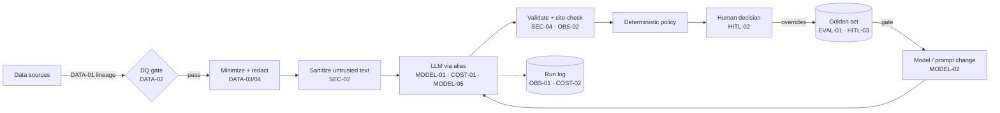

# How I govern AI workflows at a small investment firm

A small fund doesn't need an AI ethics committee and a 60-page policy. It needs about thirty
concrete controls, written as code and config, that make every AI workflow cheap to audit,
safe to change and impossible to quietly break. This is the standard every project in my
portfolio is built against.

<!-- more -->

## Why a standard, and why this one

I spent twenty years at Bridgewater and Two Sigma around systems where a wrong number
has a price. What I took from that is simple: controls that live in a policy document
decay; controls that live in the pipeline get exercised every run. So each control below
has an ID, a requirement, and the *evidence* you'd expect to find in the repo. Every
project then publishes a mapping — implemented, partial, not applicable, or "here's the
option I didn't build" — and a CI check fails if any control is missing from that mapping.

Four principles shape it:

1. **Proportional.** A research summarizer and an agent that can email a counterparty are not
   the same risk. Tier the use case first (HITL-01); the tier decides how much of the rest applies.
2. **Deterministic around the probabilistic.** Numbers come from SQL. Business and compliance
   rules run *after* the model and can't be talked out of their answer. The model drafts, explains
   and classifies inside a fence.
3. **Everything is measured.** If you can't show accuracy, cost per task and escalation rate on a
   fixed test set, you can't safely change the model — and you *will* have to change the model.
4. **Portable by default.** Provider-agnostic code, aliases instead of model IDs, and a local mode
   that runs with no keys. Lock-in is a governance risk too.

## Where the controls sit

## The control catalog

--8<-- "governance/controls.md"

## The areas that matter most in practice

### Data preparation

Most AI failures I've seen in data-heavy firms are data failures wearing an AI costume.
If a vendor file arrives half-empty, a model will still write a confident paragraph about it.
So the first hard rule is **no model call on data that hasn't passed its tests** (DATA-02). In
my projects that means dbt tests run first and the AI step reads dbt's results file and
refuses to start if anything failed.

Second is minimization (DATA-03): the model sees the fields it needs, not the table. That's
cheaper, it's easier to reason about what could leak, and it keeps MNPI and PII out of third-party
logs. Third, and specific to our industry, is **usage rights** (DATA-04): many alt-data and
broker-research licences restrict derived use or processing by third parties. That belongs in
the pipeline as a flag the policy checks, not in a lawyer's inbox after the fact.

For retrieval systems (DATA-05), the corpus is a dataset like any other: chunking strategy,
provenance per chunk, de-duplication, and an index version recorded against every answer.

### AI security

The threat model for LLM workflows is mostly covered by the OWASP Top 10 for LLM
Applications; the three I design against first:

- **Prompt injection (SEC-02).** Any text the firm didn't write — vendor notes, emails, broker
  confirms, web pages, even internal wikis — is untrusted. Delimit it, scan it, escape anything
  that could close your delimiters, and make sure the *consequence* of a successful injection is
  bounded: an injected instruction should at worst produce a bad draft that a rule escalates.
- **Excessive agency (SEC-03).** Tools are read-only unless there's a reason. Write tools sit behind
  an approval step. In AWS, the task role can invoke only the approved model ARNs.
- **Insecure output handling (SEC-04).** Model output is parsed against a schema and treated as data.
  If parsing fails, the fallback is "escalate to a human", never "best guess".

Provider terms (SEC-05) are the quiet one: approved providers and regions, zero-retention or
no-training terms where available, and a registry flag so an unreviewed model literally can't be
called.

### Cost oversight

LLM cost is a unit-economics question: dollars per task versus analyst minutes saved. The
controls are boring on purpose:

- **Hard budgets (COST-01)** — a pre-flight check before every call: prompt within the token cap,
  worst-case cost within the remaining run budget, and a refusal to run any model without
  registered pricing. Budget errors are never retried.
- **Attribution (COST-02)** — tokens and dollars per call, tagged by use case, model and prod vs eval.
- **Levers before scale (COST-03)** — smaller model for easy steps, trimmed context, prompt caching
  for static system prompts, batch APIs for overnight work.
- **A monthly number someone owns (COST-04)**, with an alert before the invoice, not after.

### Migrating to new models

Model deprecation is a certainty, not a risk. Providers retire versions on a
roughly yearly cadence, and "the same prompt on a newer model" is a behaviour change you have to test.
The pattern I use:

1. Code references **aliases** (`triage-primary`), never model IDs (MODEL-01). The registry holds
   provider, ID, pricing, approval and deprecation date.
2. Point a `candidate` alias at the new model and run the **eval gate** against the baseline
   (MODEL-02): same golden set, thresholds on accuracy, format validity, citation accuracy,
   escalation recall and cost — and no regression versus the current model.
3. Promotion is a command that refuses unless there's a passing eval **on the current prompt hash**
   (MODEL-04). Changing the prompt invalidates the eval.
4. The old model stays as fallback for a cycle (MODEL-05); `models-check` warns inside the
   deprecation window (MODEL-03).

The same gate governs prompt changes. In practice most regressions I'd worry about come from prompt
edits, not model swaps.

### Evaluation and observability

A golden set (EVAL-01) of 5–50 labelled cases beats any amount of anecdotal testing — as long as it
includes the nasty ones: the injection attempt, the compliance edge case, the empty file. Metrics
(EVAL-02) must include a safety metric such as escalation recall, not just accuracy. CI runs the
whole thing offline on every push with a mock model (EVAL-03), and a scheduled job runs it live.

Every call writes a row (OBS-01): model, prompt hash, input hash, tokens, latency, cost, outcome.
Every claim the model makes about data is checked against the data (OBS-02). And the log is kept
as long as your books-and-records obligations require (OBS-03).

### Human oversight

Tiering (HITL-01) is the control that makes the rest proportional:

| Tier | Example | Minimum controls |
|---|---|---|
| Low | Internal summarization of public documents | DATA-02/03, SEC-01/04, COST-01/02, OBS-01 |
| Medium | Advisory output that directs human work (triage, research Q&A) | All of Low + SEC-02, MODEL-01/02, EVAL-01–03, HITL-02/04 |
| High | Anything that can act: send, book, trade, file | Everything, plus approval on every write, trajectory logs, live evals, named owner sign-off |

A named human decides anything consequential (HITL-02), their disagreements are captured and
flow back into the eval set (HITL-03), and every use case has a one-page card: intended use,
not-for, owner, known limits (HITL-04).

## Mapping to frameworks

This isn't a new framework; it's an implementation checklist that lines up with the ones
auditors and allocators ask about:

| Framework | How the catalog relates |
|---|---|
| NIST AI RMF 1.0 (Govern · Map · Measure · Manage) | HITL-01/04 ≈ Govern/Map; EVAL-* ≈ Measure; MODEL-*, COST-*, OBS-* ≈ Manage |
| ISO/IEC 42001 (AI management system) | The catalog + per-project mapping is the operational layer beneath an AIMS |
| OWASP Top 10 for LLM Applications | SEC-02 (prompt injection), SEC-03 (excessive agency), SEC-04 (output handling), DATA-03 (sensitive information disclosure), COST-01 (unbounded consumption) |
| Model risk management (Fed SR 11-7 style) | Validation = EVAL-*; change control = MODEL-02/04; ongoing monitoring = OBS-*, HITL-03 |
| Regulator expectations for gen-AI in financial services (e.g. FINRA's 2024 guidance) | Supervision (HITL-02), recordkeeping (OBS-01/03), vendor risk (SEC-05, DATA-04) |

## Minimum viable governance: the first 30 days

If I were starting at a firm tomorrow:

1. **Week 1** — inventory every AI use (including the ones on personal accounts), tier them, and
   write the one-page cards.
2. **Week 2** — stand up the model registry, provider approvals and a shared cost log.
3. **Week 3** — a golden set and eval gate for the top two medium/high-tier use cases.
4. **Week 4** — injection testing and a human-approval step for anything that acts.

That's enough to answer the three questions an allocator's due-diligence questionnaire
will ask: *what AI do you use, how do you know it works, and who's accountable.*

## See it applied

Each project post has a "Governance in practice" section and a full mapping in its repo:

- [Alt-data vendor triage](altdata-triage.md) — data quality gate, injection defence, eval-gated model promotion, hard budgets.
- More projects on the [portfolio home](../../index.md).
