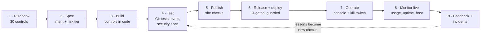

# How I govern the AI on this site, step by step

This site uses AI in four ways. It was **built** with an AI coding assistant, it **answers visitors** with a local
model, it **runs AI workflows** as live demos, and it **watches itself** while live.

Here's how I audit and govern each one, from the rulebook to the running site, with a link at every step to the
code, test, build or log that proves it. This is the evidence trail I'd want a team to show
[a non-technical leader](questions-for-your-ai-team.md).

<!-- more -->

**Stack:** GitHub Actions, MkDocs Material, Python, FastAPI, Ollama, Docker, Cloudflare Tunnel

## The map

Every arrow is automated except two: approving a spec, and deciding what to do about an incident. Those are mine.

## Step 0: Inventory: what AI runs here

| Use | What the AI does | Risk tier | Who's affected |
|---|---|---|---|
| **AI as developer** | Claude writes most of the code and posts; I direct, review and approve | Medium | Me, and anyone who trusts the site |
| **[Ask button](../../personal/posts/site-assistant.md)** | A local open model answers visitors' questions from the site's own pages | Low | Visitors |
| **[Industry demos](../../projects/index.md)** | Workflows for vendor data, end-of-day breaks, trade exceptions and research Q&A, on synthetic data with a mock model | Low (as demos) | Visitors trying them |
| **[Daily puzzle](../../personal/posts/daily-puzzle.md)** | Two agents write and check a puzzle a day | Low | Players |
| **Monitoring** | Scripts and summaries that watch the site and the server | Low | Me |

Each workflow's tier is set in its spec (`risk_tier`, for example in
[`specs/site-assistant.yaml`](https://github.com/{{GITHUB_OWNER}}/ai-portfolio/blob/main/specs/site-assistant.yaml)),
and the [governance console]({{DEMOS_URL}}/governance-console/) lists every workflow with its owner and tier. A
workflow that reports in without being registered shows up there as **shadow AI**.

## Step 1: Rulebook: one standard, enforced by a build check

**What:** 30 controls in seven groups: data quality, security, cost, model lifecycle, evaluation, audit and human
oversight. They're explained in [the governance standard](governance.md).

**Where:** [`governance/controls.md`](https://github.com/{{GITHUB_OWNER}}/ai-portfolio/blob/main/governance/controls.md)
is the single source. The post and every project read it.

**How it's enforced:**

- Every project keeps a row for **every** control in its own `docs/governance.md`, for example
  [the Ask button's mapping](https://github.com/{{GITHUB_OWNER}}/ai-portfolio/blob/main/projects/site-assistant/docs/governance.md).

- [`scripts/check_governance.py`](https://github.com/{{GITHUB_OWNER}}/ai-portfolio/blob/main/scripts/check_governance.py)
  fails the site build if any project misses one. Today it reports *30 controls × 7 projects: OK*.

## Step 2: Spec: intent and risk before any code

**What:** before anything is built, a spec states the business problem, the requirements, the risk tier, and which
controls matter most. The AI drafts it; **I approve it** before building starts.

**Where:**

- the [spec template](https://github.com/{{GITHUB_OWNER}}/ai-portfolio/blob/main/factory/project-spec.template.yaml);
- [the specs](https://github.com/{{GITHUB_OWNER}}/ai-portfolio/tree/main/specs);
- the [project-building skill](https://github.com/{{GITHUB_OWNER}}/ai-portfolio/blob/main/.claude/skills/portfolio-project/SKILL.md)
  the AI follows, which stops at the spec for approval.

**Governing the AI developer itself.** [`CLAUDE.md`](https://github.com/{{GITHUB_OWNER}}/ai-portfolio/blob/main/CLAUDE.md)
sets its rules:

- my own edits win, and it suggests changes rather than overwriting them;
- it must never claim a result it didn't run;
- it must never push or publish without my approval in the conversation.

Every commit it writes carries a `Co-Authored-By: Claude` line, so the
[history](https://github.com/{{GITHUB_OWNER}}/ai-portfolio/commits/main) shows exactly which changes were AI-written.

[`STATUS.md`](https://github.com/{{GITHUB_OWNER}}/ai-portfolio/blob/main/STATUS.md) keeps the open items, so nothing
depends on one chat's memory.

## Step 3: Build: controls live in code and config

Taking the Ask button as the example, each control is a file I can point to:

| Concern | Control | Where it lives |
|---|---|---|
| Which model, and changing it safely | MODEL-01 registry | [`config/models.yaml`](https://github.com/{{GITHUB_OWNER}}/ai-portfolio/blob/main/projects/site-assistant/config/models.yaml): code asks for an alias, never a raw model name |
| What the model is told | MODEL-04 prompt versioning | [`prompts/answer.md`](https://github.com/{{GITHUB_OWNER}}/ai-portfolio/blob/main/projects/site-assistant/prompts/answer.md), versioned in git |
| Being tricked by a visitor | SEC-02 injection defence | Page excerpts are wrapped as data, and the prompt says to ignore instructions inside them |
| Wrong claims about me | OBS-02 traceability | Answers only from numbered excerpts, each cited |
| Runaway use | COST-01 budgets | Per-visitor and daily limits in [`config/settings.yaml`](https://github.com/{{GITHUB_OWNER}}/ai-portfolio/blob/main/projects/site-assistant/config/settings.yaml) |
| Visitor privacy | DATA-03 minimisation | No IP addresses or cookies stored: a daily-rotating salted hash instead ([`app.py`](https://github.com/{{GITHUB_OWNER}}/ai-portfolio/blob/main/projects/site-assistant/src/siteassistant/app.py)) |
| Where data goes | SEC-05 provider terms | The model runs on my own server, so questions never reach a model vendor |

The demos follow the same pattern, plus human approval for anything consequential. The trade-ops agent can't write
anything until a named analyst approves.

## Step 4: Test: nothing merges on trust

**What runs on every push**, in [`ci.yml`](https://github.com/{{GITHUB_OWNER}}/ai-portfolio/blob/main/.github/workflows/ci.yml)
([runs](https://github.com/{{GITHUB_OWNER}}/ai-portfolio/actions/workflows/ci.yml)):

1. **Every project's tests**, including one test per key control. For example,
   [the Ask button's tests](https://github.com/{{GITHUB_OWNER}}/ai-portfolio/blob/main/projects/site-assistant/tests/test_assistant.py).

2. **Golden-set evaluations**, a fixed exam with expected answers, including attacks and refusals. The Ask button's
   [22 retrieval questions](https://github.com/{{GITHUB_OWNER}}/ai-portfolio/blob/main/projects/site-assistant/evals/golden_set.yaml)
   must find the right page in the top six at least 90% of the time. Today: **0.91**. That's close enough to the
   line that the next content change will tell me whether retrieval needs work.

3. **An image check:** each live app's real install contains every library its code loads
   ([`check_image_deps.py`](https://github.com/{{GITHUB_OWNER}}/ai-portfolio/blob/main/scripts/check_image_deps.py)).
   I added it after an incident (step 9).

4. **A security self-assessment**
   ([`security/pentest.py`](https://github.com/{{GITHUB_OWNER}}/ai-portfolio/blob/main/security/pentest.py)):
    - secrets anywhere in git history;
    - known-vulnerable dependencies;
    - workflow and container hygiene;
    - the hardening of the deployed stack.

    A critical or high finding fails the build.

[Dependabot](https://github.com/{{GITHUB_OWNER}}/ai-portfolio/blob/main/.github/dependabot.yml) proposes dependency
updates every week, and they go through the same tests.

## Step 5: Publish: the site checks itself

[`site.yml`](https://github.com/{{GITHUB_OWNER}}/ai-portfolio/blob/main/.github/workflows/site.yml)
([runs](https://github.com/{{GITHUB_OWNER}}/ai-portfolio/actions/workflows/site.yml)) won't publish unless:

- every project maps every control;
- every workflow ships the same telemetry client;
- the console's catalog lists every project;
- the site builds with no broken links (`mkdocs build --strict`).

## Step 6: Release and deploy: only tested code reaches the server

- **Release record:** every change is a commit; notable ones are summarised in the
  [release notes](../../release-notes/index.md). I don't tag versions. The commit plus its CI result is the release
  record.

- **Gate:** the server deploys a commit only after **all** its checks pass
  ([`update.sh`](https://github.com/{{GITHUB_OWNER}}/ai-portfolio/blob/main/deploy/selfhost/update.sh)). A failed
  build means the last good version keeps running.

- **Guard:** before starting anything, a
  [deploy guard](https://github.com/{{GITHUB_OWNER}}/ai-portfolio/blob/main/deploy/selfhost/deploy-guard.py) refuses
  any container setup that could take over the machine:
    - privileged containers;
    - access to Docker itself or to host folders;
    - containers without CPU and memory limits;
    - ports open beyond the machine itself.
- **Separation:** the guard and the scheduled scripts run from root-owned copies
  ([`install.sh`](https://github.com/{{GITHUB_OWNER}}/ai-portfolio/blob/main/deploy/selfhost/install.sh)). So a push
  to GitHub can't change what runs on the server until I've reviewed it.

## Step 7: Operate: one console, and an off switch

The [governance console]({{DEMOS_URL}}/governance-console/)
([how it works](governance-console.md)) shows every AI workflow:

- usage and cost;
- data throughput;
- safety signals, such as injection attempts and budget stops;
- each control's live evidence.

**The kill switch is enforced, not decorative.** Before every run, each app asks the console whether it's switched
on, and refuses if it isn't. Serious issues open an incident, switch the workflow off and email me. Telemetry
carries counts, hashes and flags only, never visitors' questions or documents
([the shared client](https://github.com/{{GITHUB_OWNER}}/ai-portfolio/blob/main/projects/site-assistant/src/siteassistant/telemetry.py)).

## Step 8: Monitor live

| What's watched | How often | Where it reports |
|---|---|---|
| Are the blog and every demo up? Checked from GitHub's servers, so it works even if mine is off | Every 30 min | [Uptime runs](https://github.com/{{GITHUB_OWNER}}/ai-portfolio/actions/workflows/uptime.yml) and an email ([`uptime.py`](https://github.com/{{GITHUB_OWNER}}/ai-portfolio/blob/main/scripts/uptime.py)) |
| Server load, containers, backups ([`hostmon.sh`](https://github.com/{{GITHUB_OWNER}}/ai-portfolio/blob/main/deploy/selfhost/hostmon.sh)) | Every minute | The console's Host tab; alerts by email |
| Updates waiting and reboots needed ([`maintenance.sh`](https://github.com/{{GITHUB_OWNER}}/ai-portfolio/blob/main/deploy/selfhost/maintenance.sh)) | Daily | Email, with the exact commands |
| Security self-assessment of the live site and server | Weekly | A private email (the details never go in public logs) |
| Database backups, integrity-checked ([`backup.sh`](https://github.com/{{GITHUB_OWNER}}/ai-portfolio/blob/main/deploy/selfhost/backup.sh)) | Nightly | The Host tab flags a stale backup |
| What visitors ask, what Ask couldn't answer, 👍/👎 on posts ([`digest.py`](https://github.com/{{GITHUB_OWNER}}/ai-portfolio/blob/main/projects/site-assistant/src/siteassistant/digest.py)) | Daily | An engagement email |

## Step 9: Feedback and incidents: the loop that matters most

**Feedback:**

- Questions Ask couldn't answer land in my daily email, and become content or golden-set cases.
- A 👎 on a post can carry a private note about what was missing.
- Visitors' project suggestions are only published after I approve them in the console.

**Two real incidents from this week**, both traceable end to end:

1. **The console went down unnoticed by its own alerts.** A new feature imported a library that the tests had but
   the live install didn't, so the app crashed on start-up while CI stayed green. And because the console sends the
   alerts, it couldn't report its own outage.
    - **Caught by:** the outside-in uptime check.
    - **Fixed in:** [`8bd1bb8`](https://github.com/{{GITHUB_OWNER}}/ai-portfolio/commit/8bd1bb8).
    - **The lasting fix:** the image check in step 4, so this class of bug fails the build before it deploys.
2. **A hardening change stopped the web server starting.** I removed a permission the web server needed, to clear a
   security finding.
    - **Caught by:** checking the containers after the deploy.
    - **Fixed in:** [`c6a4532`](https://github.com/{{GITHUB_OWNER}}/ai-portfolio/commit/c6a4532), with a code comment
     explaining why the permission stays.

Neither was dramatic. Both show the point: **something will go wrong, so what matters is how fast you see it, and
whether the fix becomes a check.**

## What's not done yet

- **Branch protection on GitHub** is my next settings change. Today the CI gate on the server enforces "tested before
  deployed", but GitHub itself doesn't yet block an untested merge.

- **Answer quality for Ask** is checked by hand when the model changes. Only retrieval is gated automatically
  (MODEL-02 is 🟡 in its mapping).

- **The demos' results come from synthetic data and a mock model.** They prove the controls work end to end, not
  how a real model would score on real data.

## The trace, in one table

| Concern | Controls | Rule | Code | Proof it runs |
|---|---|---|---|---|
| AI-written code is reviewed and identifiable | HITL-02, HITL-04 | [`CLAUDE.md`](https://github.com/{{GITHUB_OWNER}}/ai-portfolio/blob/main/CLAUDE.md) | Commit trailers | [Commit history](https://github.com/{{GITHUB_OWNER}}/ai-portfolio/commits/main) |
| Every project meets the standard | All 30 | [`controls.md`](https://github.com/{{GITHUB_OWNER}}/ai-portfolio/blob/main/governance/controls.md) | [`check_governance.py`](https://github.com/{{GITHUB_OWNER}}/ai-portfolio/blob/main/scripts/check_governance.py) | [Site builds](https://github.com/{{GITHUB_OWNER}}/ai-portfolio/actions/workflows/site.yml) |
| Model and prompt changes don't regress | MODEL-02, EVAL-01–03 | Golden sets per project | Eval gates | [CI runs](https://github.com/{{GITHUB_OWNER}}/ai-portfolio/actions/workflows/ci.yml) |
| No secrets or vulnerable code ships | SEC-01, SEC-06 | [`security/README.md`](https://github.com/{{GITHUB_OWNER}}/ai-portfolio/blob/main/security/README.md) | [`pentest.py`](https://github.com/{{GITHUB_OWNER}}/ai-portfolio/blob/main/security/pentest.py) | [CI runs](https://github.com/{{GITHUB_OWNER}}/ai-portfolio/actions/workflows/ci.yml) |
| Only tested, safe code runs | SEC-03, SEC-06 | [`deploy/selfhost/README.md`](https://github.com/{{GITHUB_OWNER}}/ai-portfolio/blob/main/deploy/selfhost/README.md) | [`deploy-guard.py`](https://github.com/{{GITHUB_OWNER}}/ai-portfolio/blob/main/deploy/selfhost/deploy-guard.py) | Deploy log on the server |
| Any workflow can be stopped | HITL-02, OBS-01 | [Console post](governance-console.md) | [`app.py`](https://github.com/{{GITHUB_OWNER}}/ai-portfolio/blob/main/projects/governance-console/src/govconsole/app.py) | [Live console]({{DEMOS_URL}}/governance-console/) |
| Outages are noticed | OBS-01 | [`uptime.yml`](https://github.com/{{GITHUB_OWNER}}/ai-portfolio/blob/main/.github/workflows/uptime.yml) | [`uptime.py`](https://github.com/{{GITHUB_OWNER}}/ai-portfolio/blob/main/scripts/uptime.py) | [Uptime runs](https://github.com/{{GITHUB_OWNER}}/ai-portfolio/actions/workflows/uptime.yml) |
| Lessons become checks | HITL-03 | This post | [`check_image_deps.py`](https://github.com/{{GITHUB_OWNER}}/ai-portfolio/blob/main/scripts/check_image_deps.py) | [`8bd1bb8`](https://github.com/{{GITHUB_OWNER}}/ai-portfolio/commit/8bd1bb8) |

If you run AI at your firm, this table is the shape to ask for: for every concern, the rule, the code that
enforces it, and proof that it ran recently.
