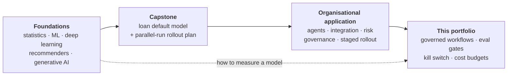

# Classes

In 2026 I took two courses with MIT Professional Education, one after the other.

1. **How AI works.** The first taught me what machine learning is and how its models work, from regression to
   transformers.
2. **How to use it responsibly.** The second taught me how to bring AI into an organisation and scale it without
   losing control: frameworks, governance and implementation plans.

| Course | When | Length | Credits | Credential | Write-up |
|---|---|---|---|---|---|
| [Applied AI and Data Science Program](https://professional.mit.edu/course-catalog/applied-ai-and-data-science-program) | Jan – May 2026 | 15 weeks, live online | 16 CEUs | [Certificate](https://credentials.professional.mit.edu/f7f85f52-ac19-4e4d-b197-194db5524f71#acc.oNVwJrWn) | [What's under the hood](posts/applied-ai-data-science.md) · [Capstone](posts/loan-default-capstone.md) |
| [Applied Agentic AI for Organizational Transformation](https://professional.mit.edu/course-catalog/applied-agentic-ai-organizational-transformation) | Jul – Sep 2026 | 8 weeks, online | 7 CEUs | [Certificate](https://www.credential.net/82c2bca4-31f2-4e5f-9e6e-709d11247dcd#acc.6rGHBmwl) | [Agents without losing control](posts/applied-agentic-ai.md) |

## How they fit together

**The first course is the foundation.** You can't govern what you can't evaluate. Fifteen weeks of statistics,
classical ML, deep learning and generative AI taught me:

- how models are fitted;
- why they overfit;
- how to measure them with the right metric for the error that matters;
- why an LLM is fluent but not necessarily right.

**The capstone is the hinge.** [Predicting loan defaults](posts/loan-default-capstone.md) was a modelling
exercise, but it ended with the organisational question: how would a bank switch this on without betting the loan
book? My answer was to run the model in parallel with the manual process, switch over only when it's no worse, then
monitor it and control every change.

**The second course scales that answer.** It moved from one model to agents across a business:

- how agents connect to real systems;
- what they cost;
- what can go wrong;
- how to roll them out in stages (Crawl / Walk / Run, sandbox → shadow → phased rollout);
- how to govern them under real regulation.

**This portfolio is where I apply both.** Every [project](../index.md) is measured against a golden set before a
change ships, and governed by the [same standard](../blog/posts/governance.md). Any of them can be switched off
from the [governance console](../blog/posts/governance-console.md).

## The write-ups

One post per course, plus the capstone. Each covers what the course covered, why it matters for AI and agentic
workflows, how I've applied it, and the work I completed.
