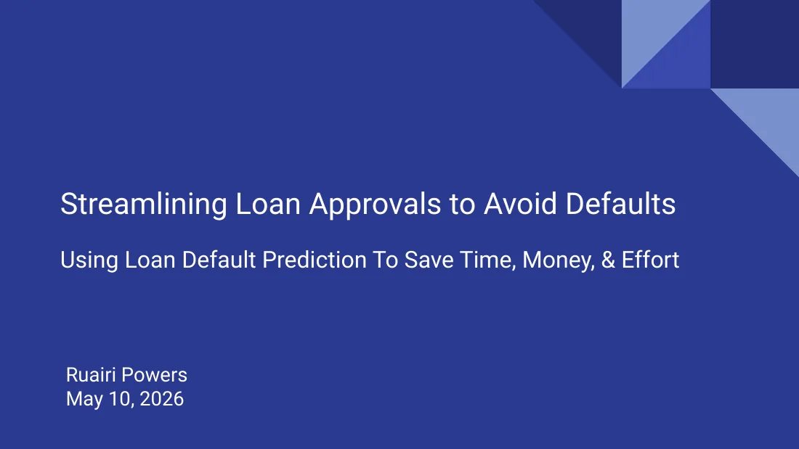
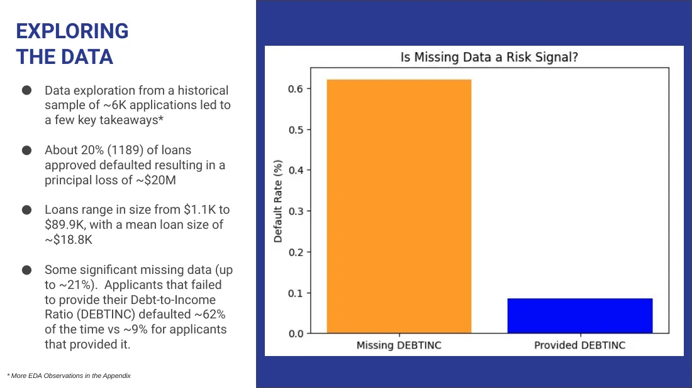
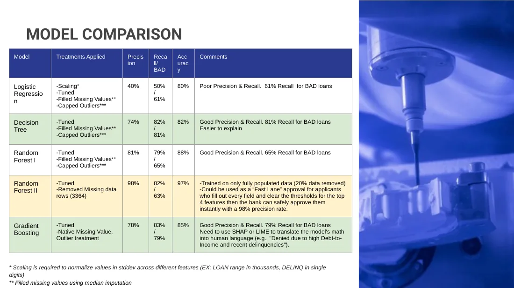
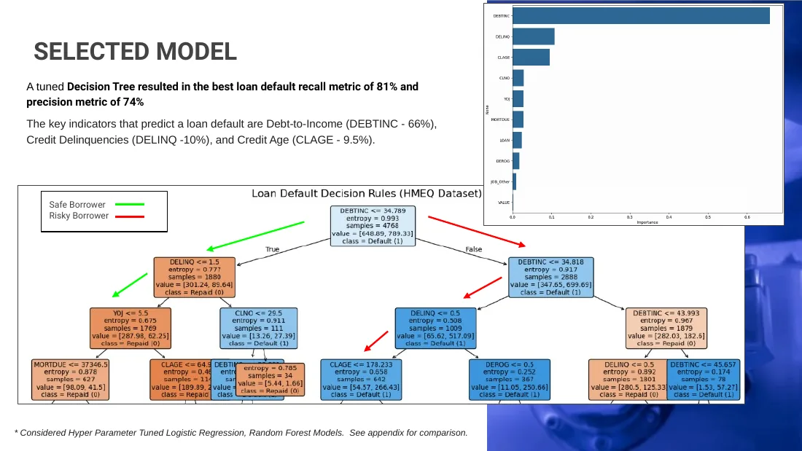
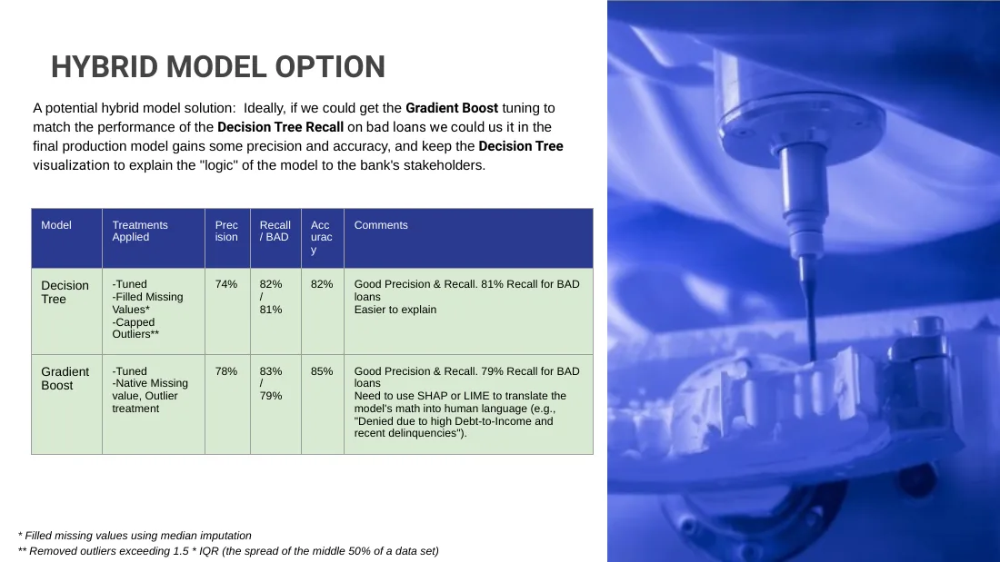
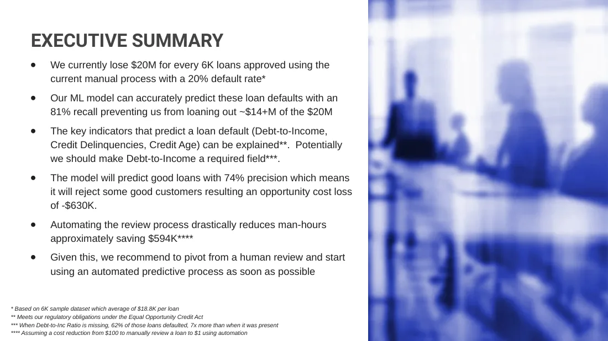
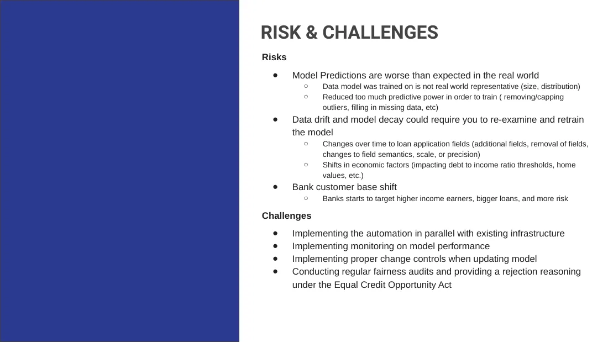
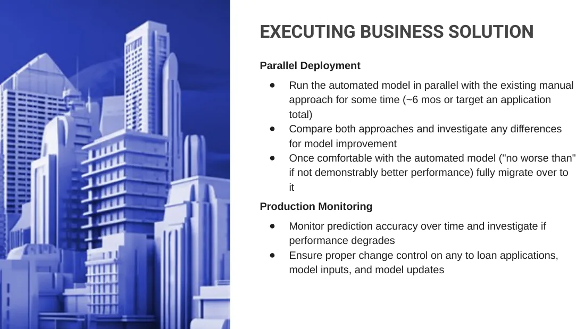

# Capstone: predicting home-loan defaults, and how I'd put the model into production

My capstone for MIT's [Applied AI and Data Science Program](applied-ai-data-science.md) was a credit decision. A
bank approves home-equity loans by hand, and one in five of those loans defaults. Could a model trained on the
application data catch the defaults? It would also have to explain every rejection, as US lending law requires.
And how would you switch it on without betting the loan book on it?

<!-- more -->

**Notebook:** [open in Google Colab](https://colab.research.google.com/github/{{GITHUB_OWNER}}/ai-portfolio/blob/main/coursework/loan-default-prediction/loan_default_prediction.ipynb)
(read-only, so run your own copy) ·
**Deck:** [the final presentation (PDF)](https://github.com/{{GITHUB_OWNER}}/ai-portfolio/blob/main/coursework/loan-default-prediction/loan-default-prediction-deck.pdf) ·
**Source:** [coursework/loan-default-prediction](https://github.com/{{GITHUB_OWNER}}/ai-portfolio/tree/main/coursework/loan-default-prediction) ·
**Stack:** Python, pandas, scikit-learn, seaborn, Matplotlib, SciPy, Jupyter, Google Colab

## Try it

The notebook opens in Colab straight from this portfolio's GitHub repository. **Runtime → Run all** reruns the
whole analysis in a few minutes, most of it the random-forest grid search. The data loads from GitHub, so there's nothing to upload. Colab gives every
visitor their own copy, which makes the original read-only. Edit anything you like; you can't break mine.

It opens showing the outputs of my final run, so you can read it without running anything. I reran it from a clean
copy before publishing, and every classification report matched.

## The problem

The data is the public HMEQ home-equity dataset: 5,960 recent loans, each with 12 application fields and whether
the borrower defaulted. 1,189 of them did. That's 20% of the loans and **$20.1M of principal**. The loans range from
$1.1K to $89.9K, averaging $18.6K.

| Field | What it is |
|---|---|
| LOAN, MORTDUE, VALUE | Amount requested, existing mortgage owed, property value |
| REASON, JOB, YOJ | Debt consolidation or home improvement; job type; years in the job |
| DEROG, DELINQ | Major derogatory reports; delinquent credit lines |
| CLAGE, NINQ, CLNO | Age of the oldest credit line; recent credit inquiries; number of credit lines |
| DEBTINC | Debt-to-income ratio |

The two kinds of error cost very different amounts.

- **Approving a loan that defaults** loses the principal.
- **Rejecting a good borrower** loses the interest.

So I optimised for **recall on defaults** (catch as many as possible) and treated precision as the cost of doing it.
I added two constraints of my own:

- **Explainable.** The Equal Credit Opportunity Act requires a reason for every rejection.
- **No inherited bias.** The model shouldn't learn whatever biases were in the past human approvals.

## What the data said

- **The best signal was a blank field.** 21% of applications have no debt-to-income ratio. Those applicants
  defaulted **62%** of the time; applicants who gave one defaulted 8.6% of the time. My first recommendation was a
  form change, not a model: make the field required.

- **Past behaviour beats current wealth.** Delinquent credit lines, derogatory reports and a short credit history
  separate the two groups. Property value barely does: its correlation with default is −0.03.

- **Defaulters borrow less.** The average defaulted loan is smaller ($16.9K against $19.0K), and both loan size and
  mortgage owed differ significantly between the groups (t-tests, p < 0.001).

- **Home-improvement loans default more than debt consolidation** (22.2% against 18.9%), the opposite of what I'd
  have guessed.

Before modelling I had to clean the data:

- Capped extreme values with the 1.5 × IQR rule. I left the delinquency counts alone, because there the extreme
  value *is* the signal.

- Filled the missing categories with the most common value.
- Treated a missing delinquency or derogatory count as zero.
- Filled the skewed money fields with the median.

## The models

All the models trained on 80% of the loans and were scored on the remaining 1,192 loans, 238 of which defaulted.
Defaults are only a fifth of the data, so every model weighted them more heavily. Otherwise a model scores 80%
accuracy by approving everyone. These are the results for the default class, from the notebook:

| Model | Defaults caught (recall) | Flagged loans that really defaulted (precision) | Notes |
|---|---|---|---|
| Logistic regression (scaled, balanced) | 61% | 41% | Linear; misses threshold effects in debt-to-income |
| Decision tree, depth 3 | 78% | 58% | Readable rules |
| **Decision tree, tuned** (GridSearchCV on recall, 10-fold) | **81%** | 53% | Entropy, depth 6, ≥ 20 loans per leaf |
| Random forest, default settings | 58% | 86% | 100% on training data: overfit |
| Random forest, tuned | 66% | 72% | Best balance of the forests |

The deck adds two experiments from after this notebook:

- A **gradient-boosting** model that handles missing values natively. It caught 79% of defaults with better overall
  precision, but every decision needs SHAP or LIME to explain it.

- A **random forest trained on complete applications only** (3,364 rows). It's precise enough to work as a
  fast-lane approval for applicants who fill in every field.

## The decision

I recommended the **tuned decision tree**. It caught the most defaults, 81%, and it's the one model a credit
officer can read. Its splits are rules. In the depth-3 version on the slide, debt-to-income above about 34.8% is
the first fork, then delinquencies, then the age of the credit history. That gives the bank a reason for every rejection.

The importances agree across models. Debt-to-income dominates (about 44% of the tuned forest's importance and
two-thirds of the tree's), followed by credit age and delinquencies. Job type and loan reason add almost nothing,
which raises a fair question: should the bank collect them at all?

The deck also proposes a hybrid. Tune gradient boosting until it matches the tree's recall, use it for the
decisions, and keep the tree as the explanation stakeholders can read.

## The business case

These figures are from the executive summary in the deck. They rest on my own assumptions, labelled as such on the
slide.

- Catching 81% of defaults would have kept roughly **$14M+** of the **$20M** lost.
- The good borrowers it wrongly rejects would cost about **$630K** in interest.
- Cutting review cost from $100 a loan by hand to $1 automated would save about **$594K** per 6,000 applications.

## Putting it into production

This is the part of the deck I'd defend hardest in a real bank, and the bridge to my
[agentic AI course](applied-agentic-ai.md):

- **Run in parallel first.** Score every application alongside the manual process for about six months, or a
  target number of applications. Investigate every disagreement. Switch over only once the model is demonstrably
  no worse.

- **Monitor and control change.** Track accuracy over time. Put change control on the application form, the
  model's inputs and the model itself.

- **Fairness audits** on a schedule, and a written reason for every rejection under the ECOA.

The deck also names the risks:

- **Unrepresentative data.** A 6,000-loan sample may not look like the real loan book.
- **Lost signal.** Capping and imputing may throw some of it away.
- **Drift.** Form fields, the economy and the customer base all change over time.

## What I'd do differently

- **Report one consistent metric.** My notebook's summary table mixes macro-averaged scores with the default-class
  scores, and one logistic-regression row was scored on unscaled features. The default-class numbers in the table
  above come from the classification reports, which are correct.

- **Treat missingness as a feature** instead of imputing it away. A blank debt-to-income ratio was the strongest
  single signal in the data.

- **Pick the decision threshold from the cost of each error.** A threshold set from $ lost per missed default
  against $ forgone per wrongly rejected good loan beats a default 0.5 cut-off with class weights.

- **Run a fairness check before recommending anything.** HMEQ has no protected attributes, so a real deployment
  would need proxy analysis and adverse-action reason codes from the start.

*Course materials belong to MIT Professional Education and its learning partner. The analysis, notebook code and
deck are mine. The HMEQ dataset is a widely used public teaching dataset.*
