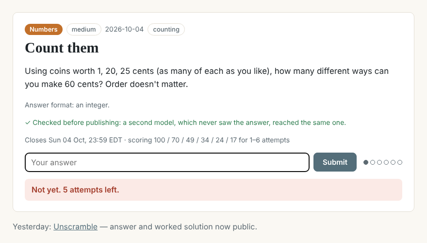
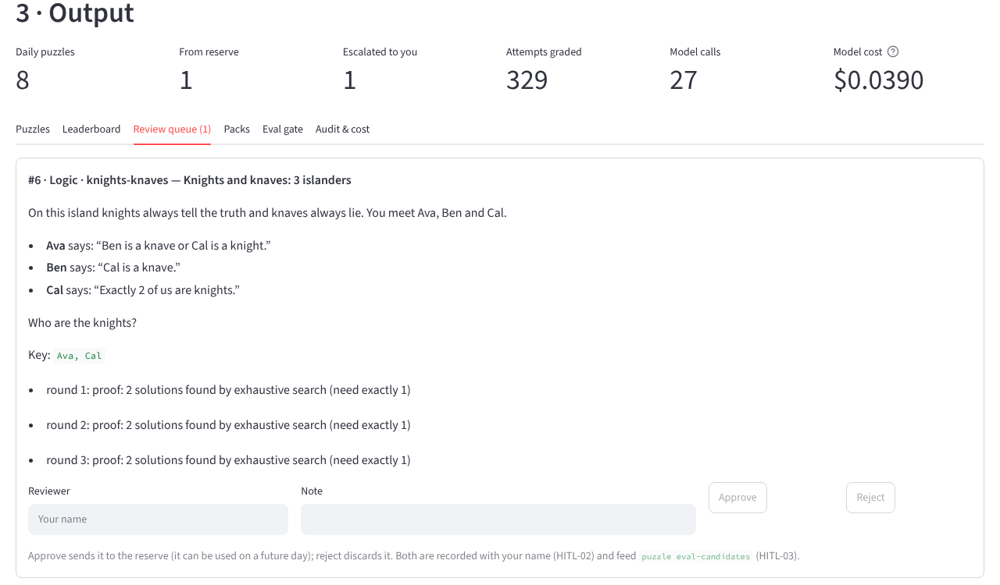
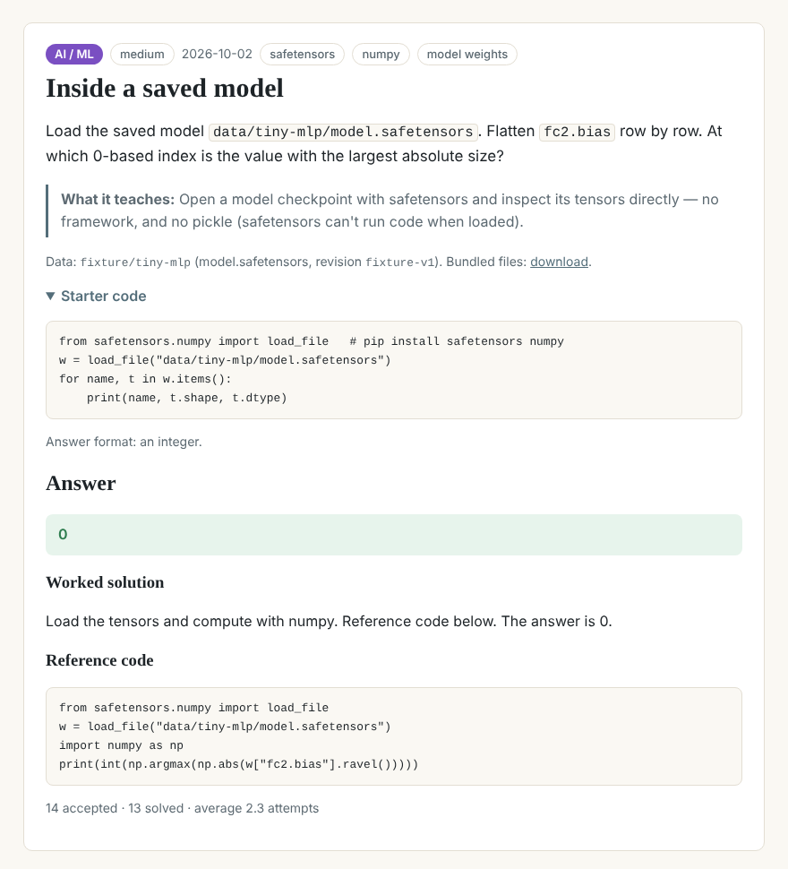

# A daily puzzle that two models have to agree on before anyone sees it

I wanted a daily puzzle for people building data and AI skills: some logic, some words, some numbers, and some that
need real code — load a saved model and sum a layer's weights, fine-tune a tiny model and report the loss. Writing
one by hand every day isn't realistic, and AI-written puzzles have a known flaw: they often have two right answers,
or a wrong answer key. So this project runs the whole day on a schedule, and nothing is published until a second
model, which never sees the answer, reaches the same one.

<!-- more -->

**Source:** [projects/daily-puzzle](https://github.com/{{GITHUB_OWNER}}/ai-portfolio/tree/main/projects/daily-puzzle) ·
runs offline in about 10 seconds with mock models, no API keys ·
**Stack:** Python, FastAPI, HTMX, APScheduler, SQLite, safetensors, WeasyPrint, Ollama

## The problem

A daily game has four jobs every day: write a puzzle, check it, grade people fairly and keep score. The checking is
the hard one. When I asked models for logic puzzles, the most common failure wasn't a bad puzzle — it was a puzzle
with a second valid answer that the model hadn't noticed. For a game with a leaderboard, that's fatal: someone types
a correct answer and is told it's wrong.

The coding and AI puzzles add two more problems. The answer has to reproduce — a fine-tune with an unseeded
shuffle gives a different loss every run. And the data has to be safe to use: licensed for it, and not a pickle file
that can run code when it's loaded.

## What it does

- **Subscribe** with an email, a public handle and the tracks you want. Double opt-in, magic-link sign-in, one-click
  unsubscribe, delete your account and scores at any time.
- **At 07:00** subscribers of that day's track get the puzzle. Accept it, answer, and each submission says at once
  whether you solved it and how many of your six attempts are left.
- **Scoring** rewards fewer attempts: 100, 70, 49, 34, 24, 17 points, nothing if unsolved, added up across puzzles.
  The leaderboard shows handle, puzzles accepted, attempted and solved, and the total; ties go to fewer attempts,
  then the earlier solve.
- **At 23:59** submissions close; a few minutes later the answer, a worked solution and (for code puzzles) the
  reference code are published. Until then the server holds no plain copy of the answer.
- **Puzzle packs:** a one-off set of new, verified puzzles as a questions PDF and a separate answer-key PDF.
- **Everything is configuration** — tracks, puzzle kinds, the weekday rotation, difficulty, attempts, scoring,
  the data allow-list — so anyone can run their own version.

The offline run (`puzzle all`) builds a reserve, simulates a week with 25 players, makes a five-puzzle pack and runs
the eval gate in about ten seconds:

| Measure (mock models) | Result |
|---|---|
| Daily puzzles published / verified first round | 8 / 8 |
| Attempts graded (25 simulated players) | 291 |
| Golden drafts decided correctly | 19 / 19 |
| Deliberately broken drafts rejected | 9 / 9 |
| Grading cases correct | 10 / 10 |
| Tests | 112 passing |

These are mock-model numbers. The mock generator writes procedural puzzles in exactly the JSON a real model must
return, which is what lets the pipeline be tested end to end for free; it says nothing yet about how often a real
model's first draft passes.

## Architecture

--8<-- "projects/daily-puzzle/docs/architecture.md:flow"

### Why this architecture

--8<-- "projects/daily-puzzle/docs/architecture.md:decisions"

The interesting trade-off is where the model's judgement is allowed. I first sketched one agent that writes a puzzle
and then checks it. That's the configuration most likely to miss its own mistake. Splitting it in two helps — a
solver with a different prompt, ideally a different model, that only sees what a player sees — but a second model's
"looks unique to me" is still an opinion.

So the verifier asks code first. Every logic, word and number puzzle carries a machine-readable copy of its clues,
and an exhaustive search counts the solutions: exactly one, and it must be the key. Every coding and AI puzzle
carries reference code that runs twice in a sandbox and must print the key both times. Only then does the blind
solver get its turn. Its job is the thing code can't check: whether the puzzle *as worded* leads to the answer. The
model writes; code proves; a second model reads it like a player.

## Governance in practice

The [full mapping](https://github.com/{{GITHUB_OWNER}}/ai-portfolio/blob/main/projects/daily-puzzle/docs/governance.md)
covers all 30 controls. Five matter most here.

**Evaluation that tests the checker (EVAL-02).** The risk is a verifier that waves bad puzzles through. The golden
set is mostly broken drafts: two valid answers, a wrong key, a repeat, offensive wording, a long quotation, a
fine-tune that doesn't reproduce, an unlicensed model, a pickle checkpoint, reference code that reads secrets.
Must-reject recall has to be 1.00 to pass, and `promote` refuses a new solver or generator without a passing report
on the current prompts. *Knob:* `eval.*` thresholds. *Not built:* comparing measured solve rates with the
generator's difficulty labels over time.

**Running code a model wrote (SEC-03).** Both the reference code and the solver's own code run in an isolated Python
process with an empty environment (no keys exist there — tested), no network, no subprocesses, no unpickling, no
reads or writes outside its workspace, and CPU, memory and time limits. Any refusal fails the run, even if the code
catches the error. Audit hooks stop a model's mistakes, not a determined attacker, and I say so in the code; that's
acceptable because only our own models' code runs — players submit answers, never code. *Knob:* `sandbox.*`.
*Not built:* a container per run, or gVisor.

**The answer key (SEC-04).** Answers are stored as salted HMACs of every accepted form, so grading never needs the
plain answer, and as an encrypted copy that only the reveal step opens, after close. The verifier's report never
contains the key. A test plays a puzzle through the site and then searches the pages, the API, the emails, the
database row and the telemetry for the answer and the worked solution. *Not built:* the AWS version, where the role
serving players has KMS encrypt-only and only the reveal function can decrypt.

**Public data rights (DATA-04).** A puzzle can only use assets on an allow-list with licence, files and size. Live,
the Hugging Face Hub's own licence tag must match, and pickle formats (`.bin`, `.pt`, `.pkl`) are refused even
for an allow-listed model, because loading one can run code. Trusted code fetches the files at a pinned revision before the sandbox runs, so the sandbox needs no network.

**People only for the failures (HITL-02).** I asked for this to run itself, and it does — but not by publishing
whatever comes out. A draft that fails three rounds goes to a review queue with every reason, the operator is
emailed, and a pre-verified reserve puzzle opens instead, so players don't notice. Approve or reject is recorded
with the reviewer's name, and decisions can be turned into new golden cases.

### Configuring it

| What to change | File | Key |
|---|---|---|
| Which tracks and puzzle kinds | `config/puzzles.yaml` | `tracks.*.enabled`, `tracks.*.kinds` |
| Which track on which day | `config/puzzles.yaml` | `rotation.weekday` |
| Difficulty by day or track | `config/puzzles.yaml` | `difficulty.*` |
| Attempts and scoring curve | `config/puzzles.yaml` | `attempts.max_per_puzzle`, `scoring.*` |
| Public data allowed | `config/puzzles.yaml` | `data_sources.*` |
| Who can make packs | `config/puzzles.yaml` | `packs.who`, `packs.player_daily_quota` |
| Generator and solver models | env | `PUZZLE_GENERATOR_MODEL`, `PUZZLE_SOLVER_MODEL` |

## Taking it to AWS

The scheduler's `tick()` is idempotent, so it maps directly onto EventBridge Scheduler calling a Lambda every
minute. Sandbox runs become Fargate tasks with no role and no internet, reading allow-listed model files from an S3
mirror through a VPC endpoint. The best upgrade is the key: KMS with a split where the site can only encrypt. The
[guide](https://github.com/{{GITHUB_OWNER}}/ai-portfolio/blob/main/projects/daily-puzzle/docs/aws-native.md) and a
Terraform starter (not applied to a live account) cover the rest.

## What I'd do next / limits

- **Measure real models.** Everything above ran on the mock pair. Next is a week of drafts from the local models on
  the EVO-X1 (a 14B generator, a different solver), counting first-round passes and what the verifier catches.
- **The mock solver reads the machine-readable clues**, not the wording, so it can't catch a statement that
  disagrees with its spec. Only a real solver model covers that case.
- **The word list is small.** Cipher and anagram checks prove uniqueness within it; an obscure second word outside
  it isn't caught.
- **Difficulty is the generator's guess.** `puzzle stats` compares solve rates with the target per level; feeding
  that back into the generator isn't built.
- **Not deployed yet.** It's packaged for the demos host at `/daily-puzzle/`; real email needs the Resend key and
  the answer-key secrets set first.

---

*Part of my [AI workflow portfolio](../../index.md). Governance controls referenced here are
defined in [How I govern AI workflows](../../blog/posts/governance.md).*
