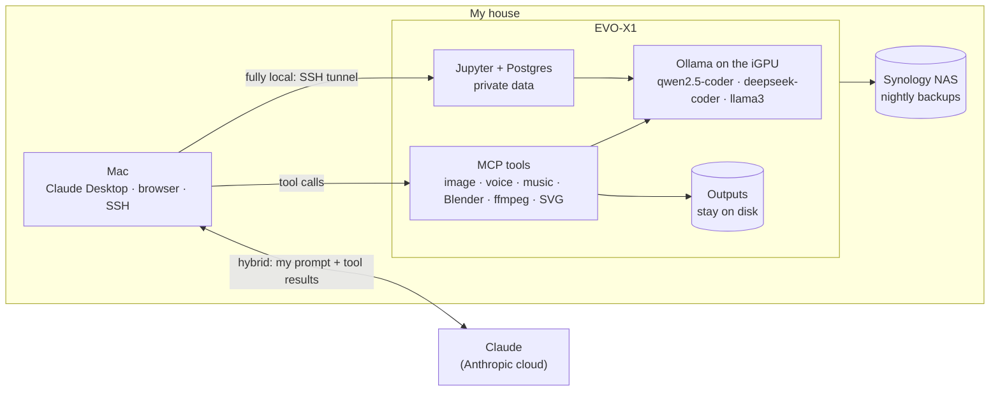

# A private AI workbench on a mini PC: what stays home, and what doesn't

I built a small AI workbench on a mini PC in my house. Models, notebooks, a database and a set of creative tools all
run on hardware I own, and I can say exactly which data leaves the machine and when. Sometimes the answer is
"never". Sometimes it's "only what I typed".

<!-- more -->

**Stack:** Ollama (ROCm), Docker Compose, Jupyter, PostgreSQL, MCP, Tailscale, Synology NAS

## The problem

Most of what I'd like help with involves data I don't want to paste into someone else's service:

- **Personal data:** finances, family photos, notes.
- **Client work:** material I'm not allowed to share.
- **Early-stage code and ideas.**

Hosted assistants have good privacy terms. But terms are a promise, not a control, and I spent 25 years in
investment firms where "where does this data go?" had to have a precise answer before anything shipped.

I also wanted to understand the trade-offs myself rather than read about them:
- what a consumer-grade machine can run;
- what it costs in effort;
- where a cloud model is still worth it.

## The goal

1. **A fully local mode.** Model, data and results all on my hardware, with nothing leaving the house.
2. **A hybrid mode** for when I want a frontier model's planning. Claude directs and my machine does the heavy work.
   The files it produces stay home.
3. **One rule I can explain in a sentence for each mode:** what crosses the network, and to whom.
4. **Rebuildable from a script,** and backed up to my own NAS.

## The machine

A GMKtec EVO-X1:
- AMD Ryzen AI 9 HX 370 with Radeon 890M integrated graphics;
- 64 GB of RAM and a 1 TB SSD;
- headless Ubuntu Server.

The graphics chip has no memory of its own; it borrows from system RAM. That's what makes a 32-billion-parameter
model possible on a box this size.

Everything runs in Docker Compose from one file. A setup script makes the host repeatable: packages, Docker,
Tailscale, a kernel flag, and the NFS mount to the NAS. Re-running it is safe.

| Service | What it's for |
|---|---|
| **Ollama (ROCm build)** | Local models on the integrated GPU: `qwen2.5-coder:32b` and `deepseek-coder:6.7b` for code, `llama3` for general text |
| **Jupyter** (data-science image) | Analysis on private data, with notebooks kept on the machine |
| **PostgreSQL 16** | A sandbox database for that analysis |
| **An MCP server** | Local tools Claude Desktop can call: image, voice and music generation, Blender renders, ffmpeg video assembly, Inkscape vector work, and plain local text generation |
| **OpenClaw** | An open-source agent, installed but not yet part of the private path |

## How it works: two modes

**Fully local.** I open Jupyter on the Mac through an SSH tunnel and work against Postgres and Ollama on the EVO.
- **What crosses the network:** nothing beyond my house.
- **Who sees the data:** me.

This is the mode for anything personal or confidential. The local coding models fit here too: I can ask
`qwen2.5-coder:32b` about code I wouldn't paste anywhere else.

**Hybrid.** Claude Desktop on the Mac connects to the EVO's MCP server. Claude plans, and the EVO does the work:
generating images or a voice-over, rendering frames in Blender, stitching video with ffmpeg, drafting text with a
local model.

| | Leaves the house | Stays home |
|---|---|---|
| **Fully local** | Nothing | Prompts, data, model output, files |
| **Hybrid** | My instructions to Claude, and the tool results Claude reads (status, file names, any text a tool returns) | The models, the rendering work and the files produced |

This mode is not "complete privacy", and I don't describe it that way. What it gives me is:
- frontier-model planning;
- local compute, so no per-image or per-minute fees;
- files that stay on my disk unless I deliberately fetch one.

One recent job rendered more than 580 frames of an animation on the box. When Claude drives a job like that, it
sees file names and progress, not the images.

The narration for my [governance console](../../blog/posts/governance-console.md) walkthrough was rendered on this
machine too, with a neutral Piper voice.

## Getting the GPU to work

This was the fiddliest part.

- **ROCm and the 890M.** ROCm doesn't officially support this chip yet. The Ollama ROCm image runs once it's told to
  treat the chip as a supported one (`HSA_OVERRIDE_GFX_VERSION=11.0.0`) and the container gets the GPU devices
  (`/dev/kfd`, `/dev/dri`) plus the host's video and render groups.
- **Hangs.** Long generations could freeze the graphics driver. A kernel flag, `amdgpu.gpu_recovery=1`, lets the
  driver reset itself instead of taking the machine down.
- **Visibility.** A small `ai-gpu` shell function shows GPU load, memory in use and temperature once a second, so I
  can see whether a model is on the GPU or quietly running on the CPU.

My portfolio's public **Ask** button also runs on this machine, but on a separate Ollama inside the hardened demo
stack: CPU only, capped on cores and memory, with a small model ([why that model](choosing-the-ask-model.md)).

I keep the two separate on purpose. The public one is boxed in, so a burst of visitors can't reach the private
models or starve them.

## Keeping it private in practice

Running locally isn't private by default. A [security self-assessment](https://github.com/{{GITHUB_OWNER}}/ai-portfolio/tree/main/security) of the
machine taught me three things:

1. **Docker ports ignore the firewall.** A container published on `0.0.0.0` is reachable from the whole home network
   even with ufw on, because Docker writes its own rules underneath. The rule I'm moving everything to: private
   services listen on `127.0.0.1` only, and I reach them through SSH or Tailscale.
2. **Tools that act on the machine need a fence.** An MCP server that can render, write files and call models is
   powerful. Anything on the Wi-Fi shouldn't be able to reach it. It's now firewalled to the devices I use.
3. **Secrets belong in an untracked `.env`, never in a compose file.** One file holds the configuration and stays
   out of git. Example values like the database password get replaced, not reused.

Backups follow the same rule. A nightly job dumps the database and copies the workspace to my own Synology NAS over
NFS, keeping seven days. Nothing goes to a cloud drive.

## What I'd do differently

- **Start with loopback-only ports.** It's easy to publish everything on all interfaces "for now" and forget.
- **Measure before choosing models.** I picked these models by reputation. For the public Ask button I benchmarked
  on the box itself and changed my mind, and these deserve the same.
- **Separate the experiments from the things I rely on.** One compose file is simple, but a crashing notebook
  shouldn't restart the database.

## What's next

- **Benchmark the local models on the GPU** (first-word latency and tokens per second), the way I did for the Ask
  button, and publish the numbers.
- **Point OpenClaw at local models only,** so the agent joins the fully local path.
- **Finish applying the network rules above** to every private service, and re-run the self-assessment.

The point isn't to avoid cloud AI. It's to choose it deliberately, knowing what crosses the wire, which is the same
discipline I'd want from any firm deciding where its data goes.
