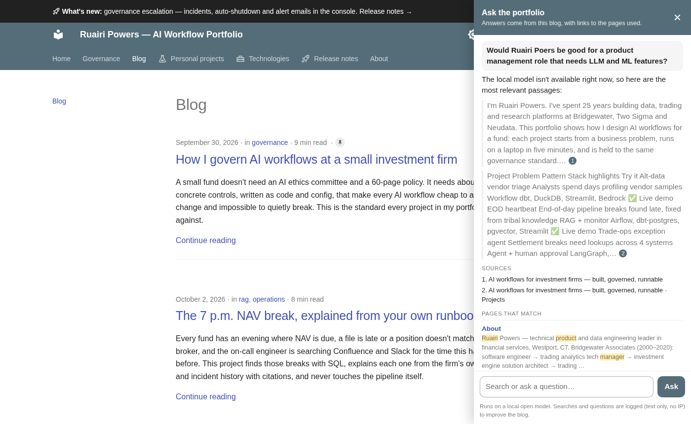

# An assistant for this blog, running on my own hardware

This blog is long: five project write-ups, a governance standard and thirty technology pages. Most visitors have
one question, and some of those questions are about me. So the blog now has an **Ask** button. It searches
everything and answers from the blog only, citing the sections it used. It runs on a local open model on the same
small server that hosts the demos, so questions never leave my machine and it costs nothing per question.

<!-- more -->

**Source:** [projects/site-assistant](https://github.com/{{GITHUB_OWNER}}/site-assistant) ·
**Try it:** the **Ask** button in the header, on any page ·
**Stack:** Python, FastAPI, SQLite FTS5, Ollama, MkDocs Material

*The panel with the model offline, so it falls back to quoting the best passages. With the model running, the
answer is written prose with numbered citations.*

## What it does

- **Search** over every page. It reads the blog's own MkDocs search index every hour, so a new post is
  searchable without a deploy.

- **Answers** from a local model through Ollama. The answer streams in, with numbered citations linking to the
  exact section. The prompt allows only the excerpts it was given, and says "the blog doesn't cover that" when
  they don't answer the question.

- **Questions about me.** A likely question from a hiring manager is "would Ruairi be a good fit for a product
  role that needs LLM and ML features?". For that kind of question, the About page always goes into the context,
  even with my name misspelt. The answer has to be balanced: roles and projects with citations, then what the
  blog doesn't show, then a pointer to the About page. It shouldn't oversell me, and the prompt says so.

- **Search and Ask are separate.** *Search* lists the matching pages, site pages first. *Ask* writes the answer.
  The panel can be expanded so it sits beside the page: click a citation, read that page, click the next, and the
  answer stays put. The history follows you around the site for three days (in your browser only), with a *Clear*
  button. On a phone, following a link closes the panel and a *Back to your answers* button brings it back.

- **Match a role.** The [3-minute tour](../../tour.md) has a box where a hiring manager pastes a job description and
  gets a *fit read* to download: where the evidence matches, with citations, what the site doesn't show yet, and
  questions worth asking me. The role and the read are saved and emailed to me, with a contact if they leave one.
  The form says so before they submit. If the model is down, the read quotes the best evidence for each
  requirement instead of summarising it.

- **Logging.** Every search, including the blog's built-in search box, every question, role match and page view.
  Each is logged as what the visitor clicked: the pages listed under an answer aren't counted as a second search.
  Questions are kept as typed so I can see what people want to know. IP addresses and cookies are not stored.

- **A daily email at 7 a.m.** with yesterday's blog views and referrers, top searches, searches that found
  nothing, questions asked, role matches, demo runs from the governance console, Cloudflare traffic, and GitHub views, clones,
  stars and forks, each against a 7-day average.

## Governed like the rest

It's a public text box on the internet with a model behind it, so it gets the same treatment as the projects:

- it reports every search and question to the [governance console](../../blog/posts/governance-console.md),
  which can switch answering off (search keeps working);

- it has per-visitor rate limits and a daily token budget;
- page text goes into the prompt as delimited data, and questions that look like injection attempts are flagged;
- the model has no tools, so the worst it can do is write a bad paragraph;
- a 16-question retrieval golden set gates changes. It currently finds the right page in the top six every time.

The full [control mapping](https://github.com/{{GITHUB_OWNER}}/site-assistant/blob/main/docs/governance.md)
covers all 30 controls.

## What I'd change

- **Embeddings.** Keyword search works on a few hundred passages of technical writing, but a question phrased
  very differently from the page can miss.

- **Feedback on answers.** A 👍/👎 per answer would turn the weak ones into golden-set cases faster than reading
  the log.

- **A bigger model** when the demos are idle. An 8B model is fine for "what does this project do". For the
  role-fit question, a larger one writes a better-balanced answer.

---

*A personal project. The main portfolio is on the [Projects page](../../projects/index.md).*
